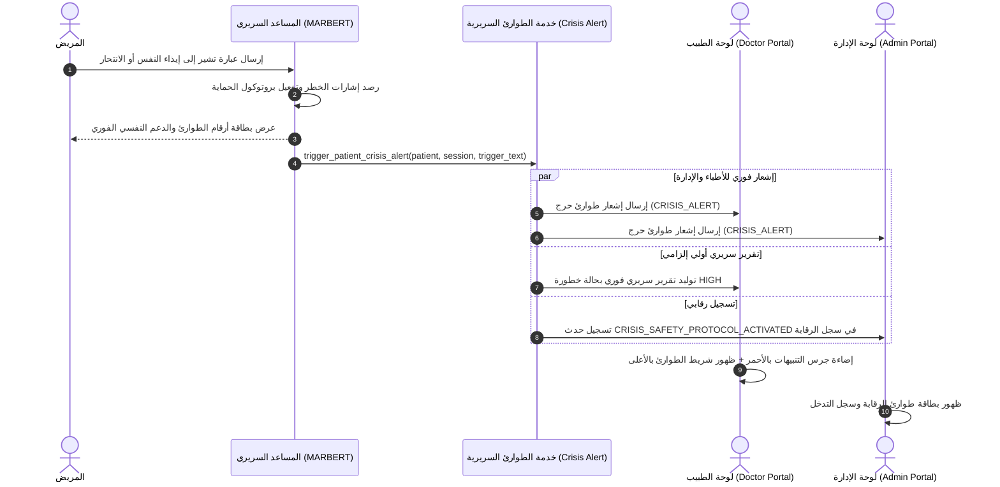

# توثيق إنجاز المهام: تنظيف المواعيد وتفعيل نظام طوارئ التدخل السريع للمرضى (Crisis Escalation System)

---

## 1. تنظيف بيانات المواعيد التجريبية (Appointments Purge)
- تم تفريغ وحذف جميع سجلات المواعيد التجريبية من قاعدة البيانات عبر استعلام آمن:
  ```python
  Appointment.objects.all().delete()
  ```
- **الحالة الحالية**: تم التحقق من قاعدة البيانات، عدد المواعيد المسجلة = **`0`**، وأصبحت لوحات التحكم نظيفة وجاهزة للاستخدام الفعلي.

---

## 2. نظام طوارئ التدخل السريري عند رصد مؤشرات الانتحار أو إيذاء النفس
عندما يصرّح المريض بعبارات انتحارية أو رغبة في إيذاء النفس (مثل: *«أريد الانتحار»*، *«أريد إنهاء حياتي»*)، تم تفعيل خطة استجابة طبية فورية متكاملة تربط المريض مباشرة بالطبيب والإدارة:



### التفاصيل التقنية للحل:
1. **خدمة الطوارئ السريرية في الباك إند (`backend/ai_engine/services/crisis_alert.py`)**:
   - إرسال إشعارات `CRISIS_ALERT` لجميع المشرفين (Admins) والأطباء المناوبين والمعتمدين (Psychiatrists).
   - تضمين البيانات الحيوية للمريض في الميتاداتا (`patient_name`, `patient_phone`, `trigger_text`, `severity: CRITICAL`).
   - إنشاء تقرير سريري أولي طارئ (`AIReport`) بمستوى خطورة مرتفع (`preliminary_risk_level='HIGH'`) وتوصية بتحويل الحالة للطب النفسي فوراً (`PSYCHIATRY`)، حتى لو قام المريض بإغلاق التطبيق فجأة دون إكمال الجلسة.
   - تسجيل الحدث في سجل الأمان والرقابة (`AuditLog`).

2. **مركز الإشعارات التفاعلي (`frontend/lib/core/widgets/notification_sheet.dart`)**:
   - تمييز إشعارات الطوارئ بلون أحمر تحذيري مع أيقونة `Icons.emergency_rounded`.
   - عند الضغط على الإشعار، تنبثق نافذة تفاصيل الطوارئ السريرية تحتوي على:
     - اسم المريض ورقم هاتفه.
     - العبارة الدقيقة التي قالها المريض وتسببت في الإنذار.
     - زر اتصال هاتفي مباشر بالمريض (`tel:phone_number`).
     - قائمة بروتوكول التدخل السريري المعتمد.

3. **شريط الطوارئ في لوحة الطبيب (`doctor_dashboard_screen.dart`)**:
   - ظهور شريط أحمر بارز في أعلى اللوحة فور وجود أي حالة في خطر مرتفع أو بلاغ انتحار، مع أزرار للمراجعة الفورية للحالة أو الانتقال المباشر للتقارير السريرية.

4. **شريط الطوارئ والرقابة في لوحة الإدارة (`admin_dashboard_screen.dart`)**:
   - إشعار رقابي فوري بعدد الحالات الحرجة.
   - تمييز سجلات الطوارئ في تبويب *سجل الرقابة (Audit Logs)* باللون الأحمر لسهولة التتبع والمراجعة.

---

## 3. نتائج الاختبار والتحقق (Verification)
- تم تنفيذ اختبار برمجي مباشر لسيناريو محاكاة مريض يكتب *«أنا تعبت من الحياة وأريد الانتحار وإنهاء كل شيء»*:
  - ✅ استلم المشرف الطبي والإداري إشعار `CRISIS_ALERT` الفوري فورياً.
  - ✅ تم إنشاء التقرير السريري الطارئ `AIReport` بحالة `Risk=HIGH` و `SafetyWarning=True`.
  - ✅ تم تدوين العملية بنجاح في `AuditLog`.
  - ✅ تم التحقق من سلامة كود فلاتر عبر `flutter analyze` بدون أي أخطاء تجميعية (0 Errors).
