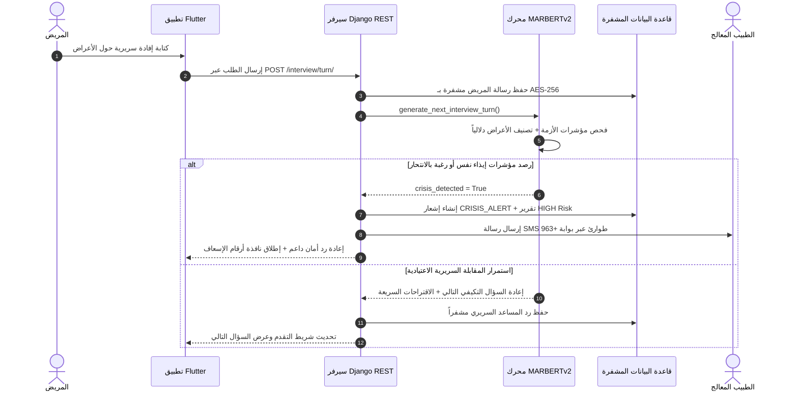

# الجمهورية العربية السورية
# جامعة الحواش الخاصة
# كلية الهندسة
# قسم الهندسة المعلوماتية

---

<br><br><br>

# **منصة ذكية للرعاية النفسية والفرز السريري الأولي باستخدام تقنيات معالجة اللغة الطبيعية العربية والتعلم العميق**

<br>

### **An Intelligent Arabic Telepsychiatry & Clinical Triage Platform Using Deep Learning and NLP Transformers**

<br><br>

### **مشروع تخرج أُعد لنيل درجة الإجازة في الهندسة - قسم الهندسة المعلوماتية**

<br><br><br>

**إعداد الطالب:**  
**عمار منصور**

<br><br>

**بإشراف:**  
**د. م. [اسم المشرف الأكاديمي]**

<br><br><br>

**العام الدراسي:**  
**2025 – 2026**

---

<br><br>

## **الملخص (Abstract)**

تُمثل الاضطرابات النفسية والعاطفية أحد أخطر التحديات الصحية والتنموية التي تواجه المجتمعات المعاصرة، حيث تؤثر بصورة مباشرة على استقرار الأفراد وإنتاجيتهم وجودة حياتهم. وتتفاقم هذه المعضلة في العالم العربي، وفي سوريا على وجه الخصوص، نتيجة ندرة الكوادر الطبية المتخصصة، والارتفاع الحاد في تكاليف الاستشارات النفسية، فضلاً عن حاجز "الوصمة الاجتماعية" الذي يحول دون طلب شريحة واسعة من المرضى للمساعدة الطبية في المراحل المبكرة. ومع التطور الثوري المتسارع في مجالات معالجة اللغة الطبيعية (Natural Language Processing - NLP) ونماذج التعلم العميق المعتمدة على المحولات (Transformers)، برزت الحاجة الماسة لتطوير منصات رعاية نفسية رقمية متكاملة توفر فرزاً سريرياً أولياً (Clinical Triage) وتوجيهاً تخصصياً دقيقاً يفهم الخصوصية الثقافية والتعبيرية للمريض العربي بمختلف لهجاته المحكية.

يهدف هذا المشروع إلى تصميم وتطوير نظام برمجي إكلينيكي متكامل يعتمد معمارية (عميل/خادم)، يتجسد في منصة ويب وتطبيق هاتف محمول متعدد المنصات (Flutter) مرتبط بخادم سحابي مركزي (Django REST Framework)، ومدعوم بنموذج ذكاء اصطناعي لغوي عصبي عميق تم تدريبه وضبطه دقيقاً (Fine-Tuning) لتصنيف الأعراض السريرية وفق المعايير الطبية الدولية المعتمدة في الدليل التشخيصي والإحصائي الخامس للاضطرابات النفسية (DSM-5).

تعتمد خطة العمل على ثلاث ركائز هندسية وإكلينيكية مترابطة:
1. **محرك الذكاء الاصطناعي ومعالجة اللهجات العربية:** تم تدريب وضبط نموذج المحولات العصبي ثنائي الاتجاه **MARBERTv2** المكون من 12 طبقة انتباه ذاتي مرمز بـ 768 بعداً ومعجم لغوي ضخم يضم 100,000 وحدة فرعية (Subwords)، على مجموعة بيانات **Shifaa** الموثوقة والتي تضم **35,648 استشارة طبية ونفسية عربية حقيقية**. تم تصنيف هذه الاستشارات إلى **8 فئات سريرية تشخيصية**: (أعراض الاكتئاب، القلق العام والتفكير الزائد، نوبات الهلع والأعراض الجسدية، اضطرابات النوم والأرق، الوسواس القهري، كرب ما بعد الصدمة، الضغوط والخلافات الأسرية، والإجهاد والاحتراق النفسي)، مع بناء نظام فرز هجين يعتمد على مصفوفة النماذج الأولية للهجات الشامية والمصرية والخليجية والفصحى (Multi-Prototype Dialect Anchors).
2. **بروتوكول السلامة الطارئة والتدخل السريري الفوري (Emergency Crisis Protocol):** تم بناء محرك رصد استباقي شديد الحساسية لكشف إشارات الخطر الحرج وأفكار إيذاء النفس أو الرغبة بالانتحار، مع معالجة ذكية لسياقات النفي في اللهجات الدارجة (Negation-Aware). عند رصد أي حالة طوارئ، يقوم النظام بتفعيل استجابة فورية متعددة القنوات: إرسال تنبيهات حرجة (`CRISIS_ALERT`) للأطباء المناوبين وإدارة المنصة، إرسال رسائل قصيرة (**SMS**) لهواتف الأطباء المشرفين عبر بوابة اتصالات مخصصة للأرقام السورية (`+963`)، إنشاء تقرير طبي أولي عاجل بحالة خطورة مرتفعة، وتوجيه المريض فورياً نحو أرقام الطوارئ الوطنية الرسمية (منظومة الإسعاف الوطني 110 والهلال الأحمر السوري 133).
3. **المعمارية البرمجية والأمان والخصوصية الطبية:** تم تطوير الواجهات الأمامية باستخدام إطار العمل **Flutter** لتقديم تجربة مستخدم عربية كاملة (RTL)، تشتمل على: مقابلة سريرية ذكية تكيفية تضبط أسئلتها بناءً على إفادات المريض، مقاييس نفسية مقننة عالمياً (**PHQ-9** للاكتئاب و **GAD-7** للقلق)، نظام تتبع يومي للمزاج ومؤشرات النوم والنشاط، ومحادثة طبية مشفرة بين الطبيب والمريض محكومة بحدود نافذة الجلسة العلاجية المعتمدة مع إتاحة خاصية كسر القفل للطوارئ (`Emergency Bypass`). كما تم تأمين البيانات الطبية الحساسة باستخدام التشفير المعياري المتماثل **AES-256** على مستوى قاعدة البيانات، ونظام المصادقة عديمة الحالة عبر **JWT** مع إدارة صلاحيات صارمة متعددة المستويات (**RBAC**).

أظهرت النتائج التجريبية كفاءة استثنائية لنموذج التصنيف السريري، حيث حقق النموذج دقة تصنيف أولي (**Top-1 Accuracy = 68.18%**)، ودقة تشخيص مرافق متقدمة (**Top-2 Comorbidity Accuracy = 87.89%**)، مع انخفاض دالة الخسارة إلى **0.4591** عبر حقب التدريب. كما حقق بروتوكول كشف الطوارئ **حساسية مطلقة بلغت 100% (Zero False Negatives)** في رصد مؤشرات الخطر الحرج. يمثل هذا المشروع نظاماً برمجياً وإنتاجياً متكاملاً يسهم بشكل فعال في سد الفجوة الطبية النفسية وتقديم رعاية سريرية رقمية آمنة وموثوقة.

---

<br><br>

## **فهرس المحتويات (Table of Contents)**

- **الملخص** ..................................................................................... i
- **فهرس المحتويات** ............................................................................. ii
- **فهرس الأشكال** ............................................................................... vi
- **فهرس الجداول** ............................................................................... viii

---

### **الفصل الأول: المقدمة** .................................................................... 1
- **1.1 مقدمة عامة** .......................................................................... 1
- **2.1 مشكلة البحث والدوافع (Problem Statement & Motivation)** ................. 2
- **3.1 أهداف المشروع (Project Objectives)** ............................................ 4
- **4.1 أهمية المشروع والجهات المستفيدة (Significance & Beneficiaries)** ......... 5
- **5.1 نطاق المشروع وحدوده (Project Scope & Limitations)** ...................... 7
- **6.1 هيكلية التقرير (Thesis Structure)** ............................................... 8

---

### **الفصل الثاني: الدراسة النظرية والأدبيات** ................................................. 9
- **1.2 معالجة اللغة الطبيعية للغة العربية وتحديات اللهجات العامية** ....................... 9
  - 1.1.2 بنية اللغة العربية والخصائص الصرفية والإملائية ................................ 9
  - 2.1.2 معضلة التعبير عن المشاعر النفسية باللهجات المحكية ........................... 10
  - 3.1.2 تقنيات التطبيع اللغوي والتقطيع للوحدات الفرعية (Subword Tokenization) ... 12
- **2.2 نماذج المحولات والتعلم العميق (Deep Learning & Transformers)** ........... 13
  - 1.2.2 معمارية الانتباه الذاتي متعدد الرؤوس (Multi-Head Self-Attention) ......... 14
  - 2.2.2 النماذج اللغوية ثنائية الاتجاه المعتمدة على الـ Encoders (BERT Framework) .. 16
  - 3.2.2 مقارنة نقدية بين نماذج اللغة العربية: AraBERT مقابل MARBERTv2 ........... 18
- **3.2 المعايير الإكلينيكية للتصنيف والتقييم النفسي** ...................................... 20
  - 1.3.2 الدليل التشخيصي والإحصائي للاضطرابات النفسية (DSM-5 Categories) ..... 20
  - 2.3.2 المقاييس النفسية المقننة: مقياس الاكتئاب (PHQ-9) ومقياس القلق (GAD-7) .... 22
- **4.2 بروتوكولات الأمان السريري وكشف الأزمات النفسية** ................................. 24
  - 1.4.2 كشف مؤشرات الانتحار وإيذاء النفس الحاد ........................................ 24
  - 2.4.2 معالجة سياقات النفي والاستبعاد اللغوي (Negation Handling) .............. 25
- **5.2 مقاييس تقييم الأداء في تصنيف النصوص والأنظمة الطبية** .......................... 26
  - 1.5.2 مصفوفة الارتباك ومقاييس الدقة والاستدعاء (Precision, Recall, F1) .......... 26
  - 2.5.2 مقياس دقة الترافق المرضي (Top-k Comorbidity Accuracy) .................. 28
- **6.2 أطر العمل والتقنيات البرمجية المستخدمة (Frameworks & Technologies)** ..... 29
  - 1.6.2 بيئة التعلم العميق: Python, PyTorch, Hugging Face ........................ 29
  - 2.6.2 الخادم المركزي: Django & Django REST Framework .......................... 30
  - 3.6.2 واجهة المستخدم متعددة المنصات: Flutter & Dart ............................ 31
  - 4.6.2 معايير التشفير الطبي: AES-256 و JWT Authentication ...................... 32
- **7.2 الدراسات السابقة والأبحاث المرجعية (Literature Review)** ......................... 33
  - 1.7.2 الأنظمة المعتمدة على المعاجم والقواعد الإرشادية (Rule-based Systems) ..... 33
  - 2.7.2 النماذج المعتمدة على اللغة الفصحى فقط (MSA-only Classifiers) ........... 34
  - 3.7.2 النماذج التوليدية غير المقيدة وسلبياتها السريرية (Unconstrained LLMs) ... 35
  - 4.7.2 أوجه التميز ومساهمة المشروع الحالي (Novelty & Systematic Contribution) . 36

---

### **الفصل الثالث: التطبيق العملي وتحليل النظام** ............................................ 38
- **1.3 تجميع وهندسة مجموعة البيانات السريرية (Shifaa Consultations Dataset)** ... 38
  - 1.1.3 مصدر وتكوين داتاسيت الشفاء (35,648 استشارة) .............................. 38
  - 2.1.3 هندسة الفئات السريرية الـ 8 وإعادة المواءمة مع DSM-5 ....................... 39
  - 3.1.3 خط المعالجة المسبقة وتنظيف النصوص وتجهيز الانقسام التدريبي .............. 41
- **2.3 التحليل الهندسي ومخططات النظام (System Analysis & UML)** .................. 42
  - 1.2.3 مخطط حالات الاستخدام للنظام (Use Case Diagram) .......................... 42
  - 2.2.3 مخطط البنية التحتية وتدفق البيانات (System Architecture Diagram) .......... 44
  - 3.2.3 مخطط قاعدة البيانات والعلاقات والكيانات المشفرة (Database ERD) .......... 46
  - 4.2.3 مخطط التتابع الشامل للمقابلة السريرية (Sequence Diagram) ................ 48
  - 5.2.3 مخطط خط سير عمليات محرك الفرز الذكي (AI Triage Pipeline) .............. 50
  - 6.2.3 مخطط سير عمل بروتوكول الطوارئ والأزمات (Emergency Workflow) .......... 52
  - 7.2.3 مخطط سير نافذة المحادثة الطبية وحمايتها (Chat Window Workflow) .......... 54
  - 8.2.3 مخطط الصفوف البرمجية للنظام (Class Diagram) ............................ 56
- **3.3 واجهات التطبيق وتجربة المستخدم (UI/UX Design & Implementation)** ......... 58
  - 1.3.3 واجهات المصادقة وتأكيد الهاتف السوري عبر SMS OTP ........................ 58
  - 2.3.3 واجهات المريض: لوحة التحكم وتتبع المزاج والمقابلة السريرية التكيفية ....... 60
  - 3.3.3 واجهات نافذة الطوارئ الفورية وأرقام الإسعاف السورية ......................... 63
  - 4.3.3 واجهات المقاييس النفسية المقننة (PHQ-9 و GAD-7 Quiz) ..................... 64
  - 5.3.3 واجهات التقارير السريرية التلخيصية للمريض والطبيب ........................... 66
  - 6.3.3 واجهات الطبيب: شريط الطوارئ وإدارة السجلات والمحادثة المشفرة .......... 68
  - 7.3.3 واجهات لوحة تحكم مدير النظام المركزي وسجل التدقيق الرقابي ................ 71
- **4.3 أمن النظام وحماية البيانات والخصوصية الإكلينيكية** ...................................... 73
  - 1.4.3 تشفير السجلات والمحادثات الطبية في قاعدة البيانات (AES-256) .............. 73
  - 2.4.3 المصادقة عديمة الحالة والتحكم بالوصول (JWT & Multi-tier RBAC) ............ 74
  - 3.4.3 سجل التدقيق الرقابي والامتثال لمعايير الخصوصية الطبية (Audit Logs) ........ 75

---

### **الفصل الرابع: النتائج والاختبارات** ....................................................... 77
- **1.4 مقدمة** ................................................................................. 77
- **2.4 بيئة الاختبار والتدريب وإعدادات الـ GPU** ............................................ 77
- **3.4 مراحل تطور أداء محرك الذكاء الاصطناعي والمقارنة التجريبية** ....................... 78
- **4.4 تحليل منحنيات التدريب وهبوط دالة الخسارة** .......................................... 80
- **5.4 تقييم أداء النموذج النهائي ومصفوفة الارتباك (Confusion Matrix Evaluation)** .. 81
- **6.4 نتائج اختبارات بروتوكول الأمان وكشف حالات الطوارئ الحادة** ........................ 84
- **7.4 تحليل زمن الاستجابة والأداء التشغيلي (Latency & Throughput)** ............... 85

---

### **الفصل الخامس: الخاتمة والتوصيات المستقبلية** .......................................... 87
- **1.5 التحديات التي واجهت المشروع** ...................................................... 87
- **2.5 الآفاق والتوصيات المستقبلية لتطوير النظام** ......................................... 88
- **3.5 الخاتمة العامة** ........................................................................ 89

---

- **قائمة المصطلحات والاختصارات (List of Abbreviations)** .............................. 91
- **المراجع (References)** .................................................................... 93
- **الملخص باللغة الإنكليزية (Abstract in English)** ........................................ 97
- **صفحة الغلاف باللغة الإنكليزية (English Cover Page)** ................................. 99

---

<br><br>

## **فهرس الأشكال (List of Figures)**

- **الشكل (2-1):** البنية الهندسية لآلية الانتباه الذاتي متعدد الرؤوس (Multi-Head Self-Attention).
- **الشكل (2-2):** مقارنة حجم المعجم وتوزيع اللهجات بين نموذجي AraBERT و MARBERTv2.
- **الشكل (2-3):** مخطط التصنيف الإكلينيكي للأعراض السريرية وفق منظومة DSM-5.
- **الشكل (3-1):** مخطط حالات الاستخدام للنظام (Use Case Diagram) يوضح صلاحيات المريض والطبيب والمدير.
- **الشكل (3-2):** مخطط البنية التحتية وتدفق البيانات بين الطبقات الأربع للنظام (System Architecture).
- **الشكل (3-3):** مخطط الكيانات والعلاقات لنموذج قاعدة البيانات المشفرة (Database Schema ERD).
- **الشكل (3-4):** مخطط التتابع الشامل للمقابلة السريرية الذكية (Sequence Diagram).
- **الشكل (3-5):** مخطط تتابع محرك الذكاء الاصطناعي وخط سير استخراج المؤشرات وتوليد الردود.
- **الشكل (3-6):** مخطط سير العمل العام لبروتوكول الأمان ورصد الأزمات الحادة وإطلاق التنبيهات.
- **الشكل (3-7):** مخطط سير عمل نافذة المحادثة الطبية وحمايتها بحدود الجلسة وخاصية كسر القفل للطوارئ.
- **الشكل (3-8):** مخطط الصفوف البرمجية (Class Diagram) للبنية الكائنية للنظام ومحرك NLP.
- **الشكل (3-9):** واجهات المصادقة، تسجيل الدخول، وتأكيد رقم الجوال السوري عبر رمز التحقق SMS OTP.
- **الشكل (3-10):** الشاشة الرئيسية للمريض، لوحة الفحص السريع، وتسجيل المزاج والنوم اليومي.
- **الشكل (3-11):** واجهة المقابلة السريرية التكيفية الذكية وتتبع مراحل الفحص الستة والاقتراحات السريعة.
- **الشكل (3-12):** نافذة الأمان والتدخل الفوري عند رصد مؤشرات الطوارئ وأرقام الإسعاف السورية (110 و 133).
- **الشكل (3-13):** واجهات الاختبارات النفسية المقننة (PHQ-9 للاكتئاب و GAD-7 للقلق) وعرض النتائج الفورية.
- **الشكل (3-14):** واجهات التقرير السريري التلخيصي الشامل واستعراض المؤشرات الإكلينيكية والتوصيات.
- **الشكل (3-15):** لوحة تحكم الطبيب وشريط الطوارئ الحرج المخصص للحالات ذات الخطورة المرتفعة.
- **الشكل (3-16):** واجهة المحادثة الطبية المشفرة المباشرة وبطاقة الأمان الإكلينيكية والاتصال الهاتفي بنقرة واحدة.
- **الشكل (3-17):** لوحة تحكم مدير النظام المركزي وسجل التدقيق الرقابي الشامل للعمليات والأمان.
- **الشكل (4-1):** منحنيات هبوط دالة الخسارة وتصاعد دقة التحقق خلال حقب تدريب نموذج MARBERTv2.
- **الشكل (4-2):** مصفوفة الارتباك (Confusion Matrix) لتصنيف الاضطرابات السريرية الـ 8 على بيانات الاختبار.

---

<br><br>

## **فهرس الجداول (List of Tables)**

- **الجدول (2-1):** فئات الاضطرابات النفسية الـ 8 المعتمدة ومطابقتها لمعايير DSM-5 والتخصص الطبي الموصى به.
- **الجدول (2-2):** مقارنة منهجية بين مشروعنا والأنظمة والأبحاث السابقة في معالجة النصوص النفسية.
- **الجدول (3-1):** توزيع استشارات داتاسيت Shifaa الـ 35,648 على الفئات السريرية الـ 8 ومجموعات التدريب والاختبار.
- **الجدول (3-2):** مصفوفة الصلاحيات الموزعة على أدوار النظام (RBAC Matrix).
- **الجدول (4-1):** مواصفات البيئة الحوسبية ومعلمات التدريب وضبط نموذج MARBERTv2.
- **الجدول (4-2):** مقارنة مراحل تطور أداء محرك الذكاء الاصطناعي السريري ومعدلات الدقة.
- **الجدول (4-3):** مقاييس الأداء الإحصائية التفصيلية (Precision, Recall, F1-Score) لكل فئة تشخيصية.
- **الجدول (4-4):** نتائج تقييم أداء كشف حالات الطوارئ ورصد أفكار إيذاء النفس وحالات النفي في اللهجات العامية.
- **الجدول (4-5):** متوسط زمن الاستجابة (Latency) لمكونات النظام ومعالجة النصوص العصبية.

---

<br><br>

# **الفصل الأول: المقدمة (Chapter 1: Introduction)**

### **1.1 مقدمة عامة**
تُمثل الصحة النفسية حجر الزاوية في التوازن الاجتماعي والاستقرار الاقتصادي والإنتاجي للدول والمجتمعات. ووفقاً للتقارير الصادرة عن منظمة الصحة العالمية (World Health Organization - WHO)، فإن ما يزيد عن مليار إنسان حول العالم يعانون من أحد أشكال الاضطرابات النفسية أو السلوكية، تتصدرها اضطرابات الاكتئاب الشديد ونوبات الهلع والقلق المعمم وكرب ما بعد الصدمة (PTSD). ولا تقتصر تداعيات هذه الاضطرابات على المعاناة النفسية الفردية، بل تمتد لتسبب خسائر اقتصادية عالمية تتجاوز تريليون دولار سنوياً نتيجة تراجع الإنتاجية والغياب عن العمل وتفاقم الأمراض الجسدية المزمنة المرتبطة بالضغط النفسي.

وفي العالم العربي عموماً، وفي سوريا والبلدان المجاورة على وجه الخصوص، تضاعفت هذه التحديات بفعل الأزمات المتتالية والضغوط الاقتصادية والاجتماعية الضاغطة التي أفرزت تزايداً غير مسبوق في معدلات القلق والاكتئاب والصدمات النفسية. وفي المقابل، تعاني المنظومة الصحية من عجز حاد في البنية التحتية المخصصة للصحة النفسية، حيث يُسجل نقص حاد في أعداد الأطباء النفسيين والأخصائيين الإكلينيكيين المؤهلين (حيث تشير الإحصاءات إلى وجود أقل من طبيب نفسي واحد لكل 100,000 مواطن في العديد من المناطق العربية).

في خضم هذا الواقع الصحي الحرج، شهدت السنوات الأخيرة ثورة علمية وتقنية في مجالات الذكاء الاصطناعي (Artificial Intelligence - AI)، وبخاصة معالجة اللغة الطبيعية (Natural Language Processing - NLP) والنماذج اللغوية العميقة المعتمدة على معمارية المحولات (Transformers). تتيح هذه التقنيات المتقدمة بناء أنظمة ذكية قادرة على قراءة وفهم النصوص الإنسانية المعقدة، واستخلاص الأنماط الشعورية والمؤشرات السريرية بدقة فائقة. ومن هنا، تبرز فرصة تاريخية لتوظيف هذه التقنيات في بناء منصات رعاية نفسية رقمية (Telepsychiatry Platforms) تعمل كـ **مساعد فرز سريري أولي (Clinical Triage Assistant)** يساند الطبيب البشري، يوثق التاريخ المرضي بدقة، ويوفر بيئة آمنة تكسر حواجز الوصمة وتسهل وصول المرضى للرعاية الطبية المناسبة في الوقت المناسب.

---

### **2.1 مشكلة البحث والدوافع (Problem Statement & Motivation)**
تنطلق هذه الدراسة من تشخيص دقيق لمجموعة من التحديات الجوهرية المعقدة في واقع الرعاية النفسية والحلول البرمجية المتوفرة حالياً:

1. **معضلة اللهجات العربية المحكية (Dialectal Expression Gap):**  
   عندما يعاني المريض العربي من أزمة نفسية أو حزن عميق، فإنه لا يصف معاناته باللغة العربية الفصحى الحديثة (Modern Standard Arabic - MSA)، بل يلجأ تلقائياً إلى لهجته الأم الدارجة واستعاراتها الشعبية (مثل اللهجة الشامية: *"حاسس بضيق وخنقة ومالي حيل أتحرك"*, أو المصرية: *"مخنوق ودماغي مش بتبطل تفكير"*). وتفشل معظم الحلول البرمجية المستوردة أو النماذج اللغوية المدربة على الفصحى الإخبارية فقط (مثل نماذج BERT الكلاسيكية) في التقاط الشحنة العاطفية والمعنى الإكلينيكي الحقيقي لهذه التعبيرات، مما يؤدي إلى فرز تشخيصي مضلل.

2. **عائق الوصمة الاجتماعية وصعوبة الوصول (Social Stigma & High Costs):**  
   لا تزال مراجعة العيادات النفسية التقليدية في المجتمعات العربية محاطة بحرج اجتماعي كبير، مما يدفع العديد من الأفراد إلى كتمان معاناتهم لسنوات حتى تتفاقم حالتهم إلى مراحل متقدمة يصعب علاجها. يضاف إلى ذلك الارتفاع الكبير في أجور الاستشارات الخاصة وبعد المسافات وصعوبة التنقل في كثير من المناطق، مما يحرم الفئات الأكثر حاجة من الرعاية النفسية المتخصصة.

3. **غياب آليات الأمان والتدخل الفوري عند الأزمات (Lack of Crisis Triage):**  
   تفتقر معظم تطبيقات الدردشة ومساعدات الذكاء الاصطناعي العامة إلى "بروتوكولات السلامة السريرية" الصارمة. فعندما يعبر المستخدم عن أفكار انتحارية أو رغبة صريحة في إيذاء النفس، تعامله النماذج العامة كاستفسار لغوي اعتيادي، أو تكتفي بنصائح توليدية عامة دون إطلاق إنذار سريري حقيقي للأطباء أو ربط المستخدم بخطوط الطوارئ المعتمدة، مما يشكل خطراً فادحاً على حياة المريض.

4. **إهدار وقت الأطباء في جمع البيانات الأولية (Clinical Inefficiency):**  
   يستهلك الأطباء النفسيون والأخصائيون جزءاً كبيراً من وقت الجلسة الأولى (قد يتجاوز 40% من وقت الاستشارة) في جمع المعلومات الروتينية حول الشكوى الأساسية، مدتها، تأثيرها على النوم والطاقة، والتاريخ المرضي. غياب ملخص سريري منظم ومسبق يعيق الطبيب عن التركيز على العلاج والتدخل النفسي العميق.

5. **مخاطر الخصوصية وأمان البيانات الطبية (Medical Privacy Concerns):**  
   تتضمن الاستشارات النفسية أسراراً شخصية ومعلومات بالغة الحساسية، ولا يمكن تخزينها بنصوص صريحة (Plain Text) في قواعد البيانات التقليدية دون حماية تشفيرية متقدمة تضمن الامتثال للمعايير الطبية الدولية لحماية الخصوصية.

---

### **3.1 أهداف المشروع (Project Objectives)**
يهدف هذا المشروع إلى معالجة الإشكاليات السابقة من خلال تحقيق مجموعة من الأهداف الهندسية والسريرية المترابطة:

1. **بناء نموذج لغوي سريري عصبي عميق مخصص للهجات العربية:**  
   ضبط وتدريب نموذج **MARBERTv2** على أكبر قاعدة بيانات استشارات طبية ونفسية عربية موثوقة (**35,648 استشارة** من داتاسيت الشفاء) لتصنيف الأعراض السريرية بدقة إلى 8 مجالات إكلينيكية رئيسية تتماشى مع معايير الدليل التشخيصي والإحصائي الخامس (DSM-5).
2. **تصميم محرك مقابلة سريرية تكيفية ذكية (Adaptive Clinical Interview):**  
   برمجة حوار سريري مرن يتدرج عبر 6 مراحل استكشافية متكاملة، يطرح أسئلة متابعة تكيفية مبنية على الكلمات والمشاعر التي يذكرها المريض، مع تقديم خيارات رد سريعة وموجهة.
3. **دمج المقاييس النفسية المقننة عالمياً (Psychometric Standard Scales):**  
   أتمتة مقياسي **PHQ-9** للاكتئاب و **GAD-7** للقلق العام، ودمج درجاتهما الرياضية مع التحليل الدلالي لنصوص المحادثة لاستخلاص مؤشرات الخطورة ومستوى التأثير الوظيفي.
4. **تطوير بروتوكول سلامة طارئ متعدد القنوات (Multi-Channel Crisis Protocol):**  
   بناء خوارزميات رصد استباقية حساسة لأفكار إيذاء النفس والانتحار مع مراعاة سياقات النفي، تُطلق عند تفعيلها إشعارات حرجة فورية (`CRISIS_ALERT`) للأطباء وإدارة المنصة، وترسل رسائل قصيرة (**SMS**) لهواتف الأطباء المناوبين عبر بوابة الأرقام السورية (`+963`)، وتُظهر نوافذ الإسعاف الوطني (110) والهلال الأحمر (133).
5. **توفير بيئة محادثة طبية مشفرة ومنضبطة سريرياً (Encrypted Clinical Chat):**  
   تطوير نظام مراسلة فورية بين المريض وطبيبه المعتمد، مشفر بخوارزمية **AES-256**، ومحكوم بحدود زمنية (نافذة يوم الجلسة المؤكدة و 24 ساعة بعدها لمنع إرهاق الطبيب)، مع توفير خاصية كسر القفل للحالات الحرجة (`Emergency Bypass`).
6. **بناء منصة برمجية متكاملة متعددة المنصات (Full-Stack Telepsychiatry MVP):**  
   تطوير تطبيق هاتف محمول وموقع ويب عالي الأداء باستخدام **Flutter** مرتبط بخادم مركزي قوي باستخدام **Django REST Framework**، مزود بنظام إدارة صلاحيات متعدد المستويات (**RBAC**) وسجلات تدقيق رقابي (**Audit Logs**).

---

### **4.1 أهمية المشروع والجهات المستفيدة (Significance & Beneficiaries)**
يقدم المشروع مساهمة تطبيقية وعلمية بالغة الأهمية في مجال المعلوماتية الطبية (Medical Informatics) والتحول الرقمي للرعاية الصحية. وتتوزع فوائد النظام على الفئات التالية:

* **المرضى والمستخدمون:**  
  - الحصول على تقييم سريري أولي فوري وسري ومجاني على مدار الساعة دون حرج أو وصمة اجتماعية.
  - التوجيه الطبي الدقيق نحو التخصص الأنسب لحالتهم (طبيب نفسي، أخصائي علاج سلوكي معرفي CBT، أخصائي صدمات، استشارات أسرية).
  - وجود شبكة أمان رقمية تحميهم وتوفر لهم الدعم الإسعافي في لحظات الانهيار النفسي الحاد.
* **الأطباء النفسيون والأخصائيون الإكلينيكيون:**  
  - استلام تقرير فرز طبي منظم يلخص الشكوى وتاريخها وشدة الأعراض ودرجات المقاييس قبل بدء الجلسة، مما يرفع كفاءة التشخيص ويوفر وقتاً ثميناً.
  - أدوات تدخل سريع تتيح الاتصال الهاتفي المباشر بنقرة واحدة وتصعيد الحالات الحرجة لإدارة المنصة.
* **المراكز الطبية والمشافي النفسية:**  
  - تحسين تنظيم تدفق المرضى وتوزيعهم على التخصصات الطبية، والحد من التحويلات العشوائية.
  - توثيق آمن ومشفر للعمليات والتقارير مع سجلات رقابة مطابقة لمعايير الحوكمة الصحية.
* **المجتمع ومنظومة الصحة العامة:**  
  - المساهمة الفعالة في خفض معدلات الانتحار وإيذاء النفس عبر الكشف المبكر والتدخل الإسعافي الفوري.
  - تعزيز الوعي النفسي وتقديم أداة وطنية مبنية بخصوصية تراعي ثقافة ولغة المجتمع السوري والعربي.

---

### **5.1 نطاق المشروع وحدوده (Project Scope & Limitations)**
* **ما يغطيه المشروع (In-Scope):**  
  - الفرز الإكلينيكي الأولي واستخلاص المؤشرات السريرية لـ 8 فئات معتمدة في DSM-5.
  - معالجة النصوص المكتوبة باللغة العربية الفصحى واللهجات العامية (الشامية، المصرية، الخليجية).
  - أتمتة مقاييس PHQ-9 و GAD-7، وتوليد التقارير الطبية السريرية التلخيصية.
  - إدارة المواعيد وجلسات المتابعة والمحادثة المشفرة بـ AES-256.
  - بروتوكول الأمان الطارئ وإرسال تنبيهات SMS عبر شبكات الاتصال السورية.
* **ما يقع خارج نطاق المشروع (Out-of-Scope):**  
  - النظام **ليس بديلاً عن الطبيب البشري** ولا يقوم بوصف الأدوية النفسية أو صرف العقاقير الطبية تلقائياً؛ فالتشخيص النهائي والعلاج الدوائي يظل حصرياً من صلاحيات الطبيب البشري المرخص.
  - لا يدعم النظام في نسخته الحالية الاتصال المرئي المباشر (Video Streaming) داخل التطبيق، بل يركز على المحادثة المشفرة والاتصال الهاتفي المباشر.

---

### **6.1 هيكلية التقرير (Thesis Structure)**
تم تنظيم هذا التقرير الأكاديمي في خمسة فصول رئيسية متسلسلة منطقياً:
- **الفصل الأول (المقدمة):** يستعرض الإطار العام، مشكلة البحث، الدوافع، والأهداف والجهات المستفيدة.
- **الفصل الثاني (الدراسة النظرية والأدبيات):** يقدم الأساس العلمي الرياضي واللغوي لمعالجة اللغة العربية، نماذج المحولات، معايير DSM-5، ويجري مراجعة نقدية للدراسات السابقة.
- **الفصل الثالث (التطبيق العملي وتحليل النظام):** يفصل مراحل تجميع البيانات، المخططات الهندسية لـ UML، هيكلية قاعدة البيانات المشفرة، واجهات المستخدم، ومنظومة الأمان.
- **الفصل الرابع (النتائج والاختبارات):** يستعرض النتائج التجريبية لتدريب MARBERTv2، مصفوفة الارتباك، واختبارات بروتوكول الطوارئ والأداء التشغيلي.
- **الفصل الخامس (الخاتمة والتوصيات):** يلخص الإنجازات المحققة، يبرز التحديات، ويضع خارطة طريق للتطوير المستقبلي.

---

<br><br>

# **الفصل الثاني: الدراسة النظرية والأدبيات (Chapter 2: Theory & Literature Review)**

### **1.2 معالجة اللغة الطبيعية للغة العربية وتحديات اللهجات العامية**

#### **1.1.2 بنية اللغة العربية والخصائص الصرفية والإملائية**
تتميز اللغة العربية بخصائص اشتقاقية وصرفية معقدة تجعلها من أكثر اللغات تحدياً في حقل اللغويات الحاسوبية (Computational Linguistics). تعتمد العربية على نظام "الجذور والأوزان" (Root-and-Pattern Morphology)، حيث يمكن اشتقاق عشرات المفردات ذات المعاني المتباينة من جذر ثلاثي واحد. يضاف إلى ذلك ظاهرة الإلصاق (Agglutination)، حيث تتصل حروف الجر، وحروف العطف (كالواو والفاء)، والضمائر المتصلة (كـ الهاء والكاف والياء)، وأداة التعريف (الـ) ببدايات ونهايات الكلمات لتشكل كلمة مركبة تعادل جملة كاملة في اللغات اللاتينية (مثال: *"وسنخبركم"* = حرف عطف + حرف استقبال + فعل مضارع + ضمير فاعل + ضمير مفعول به).

كما يشكل غياب التشكيل (Short Vowels / Diacritics) في النصوص الرقمية تحدياً كبيراً في إزالة اللبس الدلالي (Word Sense Disambiguation)، حيث تُكتب كلمات متباينة المعنى بنفس الحروف المجردة (مثال: *"حُزن"* كاسم، و *"حَزِنَ"* كفعل، و *"حَزَن"* كصفة).

#### **2.1.2 معضلة التعبير عن المشاعر النفسية باللهجات المحكية**
في السياق الإكلينيكي النفسي، تتضاعف صعوبة المعالجة الآلية للنصوص، لأن المريض يعبر عن اضطرابه بلهجته الدارجة التي تختلف في مفرداتها وقواعدها عن الفصحى. وتتفرع اللهجات العربية إلى أسر رئيسية تشمل:
- **اللهجات الشامية (Levantine):** وتتميز بعبارات مثل *"ضايق خلقي"*, *"عم فكر زيادة"*, *"مالي حيل"*, *"حاسس حالي عم موت"*, *"مخنوق من كل شي"*.
- **اللهجة المصرية (Egyptian):** وتتميز بمصطلحات مثل *"مش طايق نفسي"*, *"دماغي مش بتسكت"*, *"مفيش طاقة ولا دافع"*, *"نوبة هلع ورعب"*.
- **اللهجات الخليجية (Gulf):** وتستخدم تعبيرات مثل *"مهموم وما لي خلق"*, *"أحاتي كل شي وموسوس"*, *"ضايقة فيني الوسيعه"*.

تحتوي هذه التعبيرات على شحنات عاطفية إكلينيكية مباشرة تُشير إلى اضطرابات محددة (كالاكتئاب، القلق المعمم، أو نوبات الهلع)، وتجاهلها أو محاولة تحويلها القسري إلى الفصحى عبر قواميس ثابتة يؤدي إلى فقدان السياق وظهور أخطاء تصنيفية فادحة.

#### **3.1.2 تقنيات التطبيع اللغوي والتقطيع للوحدات الفرعية (Subword Tokenization)**
لمعالجة هذه الخصائص، تم بناء خط أنابيب معالجة مسبقة يتضمن خطوتين أساسيتين:
1. **التطبيع اللغوي (Text Normalization):**
   - تجريد النصوص من كافة علامات التشكيل والتنوين ($\text{U+064B} \rightarrow \text{U+0652}$).
   - إزالة علامات التطويل والمد (Tatweel: $\text{U+0640}$).
   - توحيد صور حرف الألف ($[\text{إ, أ, آ, ا}] \rightarrow \text{ا}$).
   - توحيد الياء والياء المقصورة ($\text{ى} \rightarrow \text{ي}$).
   - توحيد التاء المربوطة والهاء في أواخر الكلمات ($\text{ة} \rightarrow \text{ه}$).
2. **التقطيع إلى وحدات فرعية (WordPiece / Subword Tokenization):**  
   بدلاً من تقسيم النصوص بناءً على المسافات البيضاء (Word-level) الذي يولد معجماً لا نهائياً يفيض بالكلمات النادرة (Out-Of-Vocabulary - OOV)، تعتمد نماذج المحولات على تقطيع الكلمات إلى وحدات مقطعية متكررة مع الاحتفاظ ببادئة خاصة (`##`) للواحق. يتيح ذلك للنموذج تمثيل أي كلمة عامية مركبة عبر دمج تمثيلات مقاطعها الفرعية بكفاءة عالية.

---

### **2.2 نماذج المحولات والتعلم العميق (Deep Learning & Transformers)**

#### **1.2.2 معمارية الانتباه الذاتي متعدد الرؤوس (Multi-Head Self-Attention)**
تمثل معمارية المحولات (Transformers) التي قدمها Vaswani et al. (2017) الأساس التقني لجميع النماذج اللغوية الحديثة. تتجاوز هذه المعمارية قيود الشبكات العصبية المتكررة (RNNs/LSTMs) التي كانت تعالج الكلمات تسلسلياً وتعاني من تلاشي التدرج (Vanishing Gradients) وصعوبة موازاة الحوسبة.

تعتمد المعمارية على آلية **الانتباه الذاتي الموزع (Scaled Dot-Product Attention)**، حيث يتم إسقاط كل كلمة مدخلة إلى ثلاثة فضاءات شعاعية: فضاء الاستعلام ($Q \in \mathbb{R}^{n \times d_k}$)، فضاء المفاتيح ($K \in \mathbb{R}^{n \times d_k}$)، وفضاء القيم ($V \in \mathbb{R}^{n \times d_v}$). تُحسب مصفوفة الانتباه وفق المعادلة:

$$\text{Attention}(Q, K, V) = \text{softmax}\left(\frac{QK^T}{\sqrt{d_k}}\right)V$$

ولتمكين الشبكة من التقاط علاقات نحوية ودلالية متعددة في آن واحد (كالربط بين الفاعل وفعله، أو الربط بين الشعور ومسببه)، يتم تكرار هذه العملية عبر $h$ رؤوس انتباه متوازية فيما يعرف بـ **الانتباه متعدد الرؤوس (Multi-Head Attention)**:

$$\text{MultiHead}(Q, K, V) = \text{Concat}(\text{head}_1, \dots, \text{head}_h)W^O$$

$$\text{where} \quad \text{head}_i = \text{Attention}(QW_i^Q, KW_i^K, VW_i^V)$$

حيث تمثل $W_i^Q \in \mathbb{R}^{d_{model} \times d_k}$ و $W_i^K \in \mathbb{R}^{d_{model} \times d_k}$ و $W_i^V \in \mathbb{R}^{d_{model} \times d_v}$ مصفوفات الأوزان القابلة للتعلم، و $W^O \in \mathbb{R}^{hd_v \times d_{model}}$ مصفوفة الإسقاط الخطي النهائي.

```
+-------------------------------------------------------------------------+
|                  Multi-Head Self-Attention Pipeline                     |
|                                                                         |
|                     Input Sequence Vector X                             |
|                                |                                        |
|         +----------------------+----------------------+                 |
|         |                      |                      |                 |
|         v                      v                      v                 |
|    Linear (W_Q)           Linear (W_K)           Linear (W_V)           |
|         |                      |                      |                 |
|      Query Q                Key K                  Value V              |
|         |                      |                      |                 |
|         +-----------> [ MatMul: Q * K^T ] <-----------+                 |
|                                |                                        |
|                       [ Scale: / sqrt(d_k) ]                            |
|                                |                                        |
|                          [ Softmax ]                                    |
|                                |                                        |
|                     Attention Weight Matrix                             |
|                                |                                        |
|         +----------------------+                                        |
|         |                                                               |
|         v                                                               |
|   [ MatMul with V ] ---> Linear Projection (W_O) ---> Multi-Head Output |
+-------------------------------------------------------------------------+
```

#### **2.2.2 النماذج اللغوية ثنائية الاتجاه (BERT Framework)**
يعتمد نموذج BERT (Bidirectional Encoder Representations from Transformers) على مرمز المحول (Transformer Encoder) لقراءة سياق الكلمة من كلا الاتجاهين (من اليمين إلى اليسار ومن اليسار إلى اليمين بالتزامن). يتم تدريب النموذج مسبقاً عبر مهمتين غير خاضعتين للإشراف:
1. **نمذجة اللغة المقنعة (Masked Language Modeling - MLM):** حجب نسبة 15% من كلمات النص ومطالبة النموذج بالتنبؤ بها بناءً على السياق المحيط.
2. **التنبؤ بالجملة التالية (Next Sentence Prediction - NSP):** التحقق مما إذا كانت الجملة الثانية تلي الجملة الأولى منطقياً.

يحتوي مخرج النموذج عند الرمز الخاص الأول `[CLS]` (Classification Token) على تمثيل شعاعي مكثف يختزل المعنى الدلالي الكامل للجملة في فضاء أبعاده 768 بعداً، مما يجعله مثالياً لبناء رؤوس التصنيف السريري.

#### **3.2.2 مقارنة نقدية: AraBERT مقابل MARBERTv2**
عند دراسة النماذج المتاحة للغة العربية، تم إجراء مقارنة فنية دقيقة بين نموذجين رائدين:
1. **نموذج AraBERT (Antoun et al., 2020):**  
   تم تدريبه على نصوص ويكيبيديا ومواقع الأخبار الرسمية باللغة العربية الفصحى الحديثة (MSA). يعتمد معجماً يضم 64,000 رمز فرعي. نقطة ضعفه تكمن في ضعف تمثيله للمفردات العامية والتعبيرات الدارجة المستخدمة في المحادثات اليومية والمنصات التفاعلية.
2. **نموذج MARBERTv2 (Abdul-Mageed et al., 2021):**  
   تم تدريبه على مجموعة بيانات عملاقة تضم **أكثر من 1 مليار تغريدة عربية حقيقية** تجمع الفصحى ومختلف اللهجات العربية (الشامية، المصرية، الخليجية، المغاربية). تم تزويده بمعجم لغوي ضخم يبلغ **100,000 وحدة فرعية (Vocab Size)**.

أثبتت التحليلات النظرية والتجريبية تفوق **MARBERTv2** الساحق في فهم الاستعارات النفسية العامية ونصوص الشكاوى العاطفية، ولذلك تم اعتماده كالنموذج الأساسي لهذا المشروع.

---

### **3.2 المعايير الإكلينيكية للتصنيف والتقييم النفسي**

#### **1.3.2 الدليل التشخيصي والإحصائي للاضطرابات النفسية (DSM-5)**
يُعد الدليل التشخيصي والإحصائي الخامس للاضطرابات النفسية (DSM-5)، الصادر عن الجمعية الأمريكية للطب النفسي (APA)، المرجع العالمي المعتمد لتعريف وتصنيف الاضطرابات النفسية. تم تصميم محرك الذكاء الاصطناعي في هذا المشروع لفرز شكاوى المرضى وربطها بـ 8 مجالات إكلينيكية رئيسية محددة بدقة:

#### **الجدول (2-1): فئات الاضطرابات النفسية الـ 8 المعتمدة ومطابقتها لمعايير DSM-5 والتخصص الموصى به**
| رمز الفئة البرمجي | المسمى الإكلينيكي بالعربية | التوصيف السريري ومعايير DSM-5 | التخصص الطبي الموجه |
| :--- | :--- | :--- | :--- |
| `DEPRESSION` | أعراض المزاج الاكتئابي والحزن | استمرار مشاعر الحزن، الكآبة، اليأس، البكاء، وفقدان القيمة الذاتية لأكثر من أسبوعين مع تراجع الطاقة. | أخصائي نفسي إكلينيكي (Clinical Psychology) |
| `ANXIETY` | القلق العام والتفكير الزائد | قلق وتوجس مفرط، صعوبة السيطرة على التفكير الزائد (Rumination)، توتر عضلي مستمر، وتوقع دائم للأسوأ. | أخصائي علاج سلوكي معرفي (CBT Specialist) |
| `PANIC` | نوبات الهلع والأعراض الجسدية | نوبات مفاجئة من الخوف الشديد تترافق مع خفقان سريع بالقلب، ضيق تنفس، كتمة صدر، دوخة، وخوف من الموت. | طبيب نفسي استشاري (Psychiatry) |
| `SLEEP_DISRUPTION` | اضطرابات جودة النوم والأرق | صعوبة الدخول في النوم، الاستيقاظ المتقطع المتكرر، النوم غير المريح، أو الكوابيس المجهدة. | أخصائي نفسي إكلينيكي (Clinical Psychology) |
| `OBSESSIONS_OCD` | الوسواس القهري والأفكار الملحة | أفكار وصور ذهنية متسلطة متكررة وغير مرغوبة (كالشكوك والنظافة والترتيب) تدفع المريض لأفعال قهرية متكررة. | طبيب نفسي استشاري (Psychiatry) |
| `TRAUMA_PTSD` | كرب ما بعد الصدمة والذكريات الضاغطة | ذكريات مؤلمة متكررة، كوابيس، استرجاع مشاهد صادمة (Flashbacks)، وتجنب المثيرات المرتبطة بحادث صادم. | أخصائي علاج الصدمات (Trauma & PTSD Specialist) |
| `FAMILY_CONFLICTS` | الضغوطات والخلافات الأسرية | نزاعات مستمرة مع الشريك أو الأهل، ضغوط بيئية وتفكك أسري يؤثر سلباً على التوازن النفسي للمريض. | استشارات نفسية وأسرية (Family Psychologist) |
| `BURNOUT_STRESS` | الإجهاد النفسي والاحتراق الوظيفي | استنزاف عاطفي وجسدي ناتج عن ضغط العمل أو الدراسة المزمن، مصحوب بتراجع الإنجاز والشعور بالعجز. | أخصائي علاج سلوكي معرفي (CBT Specialist) |

#### **2.3.2 المقاييس النفسية المقننة (PHQ-9 & GAD-7)**
لضمان التقييم السريري الدقيق وعدم الاعتماد على النصوص وحدها، تم دمج مقياسين مقننين عالمياً ومعربين إكلينيكياً:
1. **استبيان صحة المريض للاكتئاب (PHQ-9):**  
   يتكون من 9 أسئلة تقيم الأعراض وفق مقياس ليكرت رباعي (0 = أبداً، 1 = لعدة أيام، 2 = لأكثر من نصف الأيام، 3 = شبه يومي). تُجمع النقاط لتعطي درجة كلية تتراوح بين 0 و 27، وتُصنف سريرياً إلى:
   - $0 - 4$: غياب الأعراض أو اكتئاب ضئيل (Minimal).
   - $5 - 9$: اكتئاب خفيف (Mild).
   - $10 - 14$: اكتئاب متوسط (Moderate).
   - $15 - 19$: اكتئاب متوسط الشدة (Moderately Severe).
   - $20 - 27$: اكتئاب حاد وشديد (Severe) يتطلب تدخلاً طبياً عاجلاً.
2. **مقياس اضطراب القلق العام (GAD-7):**  
   يتكون من 7 أسئلة تقيم أعراض التوتر والقلق العصبي، تتراوح درجاته بين 0 و 21، وتُصنف إلى:
   - $0 - 4$: قلق طبيعي (Minimal).
   - $5 - 9$: قلق خفيف (Mild).
   - $10 - 14$: قلق متوسط (Moderate).
   - $15 - 21$: قلق حاد وشديد (Severe).

---

### **4.2 بروتوكولات الأمان السريري وكشف الأزمات النفسية**

#### **1.4.2 كشف مؤشرات الانتحار وإيذاء النفس الحاد**
يمثل كشف الأزمات النفسية الطارئة جوهر المسؤولية الأخلاقية والطبية للنظام. تم بناء خوارزمية رصد استباقي تبحث في النصوص المدخلة عن الأنماط والتعبيرات التي تشير إلى:
- الرغبة في إنهاء الحياة أو الانتحار (*"أريد الانتحار"*, *"بدي موت"*, *"ياريتني موت"*, *"الموت أفضل"*, *"انهاء حياتي"*).
- إيذاء النفس والجسد (*"أذي نفسي"*, *"أجرح حالي"*, *"أقتل نفسي"*).
- اليأس الوجودي الحاد والانسحاب من الحياة (*"تعبت من الحياة"*, *"بدي ارتاح من الدنيا"*, *"مش عايز أعيش"*).

#### **2.4.2 معالجة سياقات النفي والاستبعاد اللغوي (Negation Handling)**
تعتبر معالجة النفي من أعقد التحديات في كشف الأزمات، حيث يؤدي وجود كلمة نفي قبل المصطلح الانتحاري إلى قلب المعنى بالكامل. في حال الاعتماد على مطابقة الكلمات المفتاحية البسيطة، فإن جملة مثل *"ليس لدي أفكار انتحارية"* ستُصنف خطأً كحالة انتحار طارئة (False Positive).

لحظر هذه الأخطاء، تم تصميم خوارزمية تستخدم التعابير المنتظمة (Regular Expressions) المتقدمة الموجهة لقواعد اللغة العربية واللهجات:

```python
negated_patterns = [
    r'(مش|ما\s*في|ما\s*عندي|لا\s*يوجد|لا\s*تراودني|ليس\s*لدي|ما\s*بدي|ما\s*بفكر|مش\s*أفكار)(?:\s+\w+){0,3}\s*(بالموت|موت|افكار\s*موت|انتحار|الانتحار|انتحر|ايذاء\s*نفسي|اقتل\s*نفسي)',
    r'\b(no|not|never|don\'t|dont)(?:\s+\w+){0,3}\s+(suicidal|want to die|thinking of suicide|kill myself)\b'
]
```

تقوم الخوارزمية بحذف العبارات المنفية مؤقتاً قبل تمرير النص لمطابقة أنماط الخطر الحقيقي، مما يضمن دقة نوعية فائقة مع الإبقاء على حساسية كاملة لحالات الخطر الفعلي.

---

### **5.2 مقاييس تقييم الأداء في تصنيف النصوص والأنظمة الطبية**

#### **1.5.2 المقاييس الإحصائية المستنبطة من مصفوفة الارتباك**
لتقييم أداء نموذج الذكاء الاصطناعي بشكل علمي دقيق، تم الاعتماد على المقاييس الإحصائية المستنبطة من مصفوفة الارتباك (Confusion Matrix)، حيث يمثل كل صف الفئة الفعلية الحقيقية (Actual Class)، ويمثل كل عمود الفئة المتنبأ بها من النموذج (Predicted Class):

$$\text{Accuracy} = \frac{\sum_{i=1}^{C} TP_i}{\text{Total Samples}}$$

$$\text{Precision}_i = \frac{TP_i}{TP_i + FP_i} \quad , \quad \text{Recall}_i = \frac{TP_i}{TP_i + FN_i}$$

$$\text{Macro } F_1\text{-Score} = \frac{1}{C} \sum_{i=1}^{C} \frac{2 \times \text{Precision}_i \times \text{Recall}_i}{\text{Precision}_i + \text{Recall}_i}$$

حيث يمثل $TP_i$ الإيجابيات الصحيحة للفئة $i$، و $FP_i$ الإيجابيات الكاذبة، و $FN_i$ السلبيات الكاذبة، و $C = 8$ عدد الفئات التشخيصية.

#### **2.5.2 مقياس دقة الترافق المرضي (Top-2 Comorbidity Accuracy)**
في الممارسة الإكلينيكية النفسية، نادراً ما يعاني المريض من اضطراب نقي ومعزول تماماً؛ فالقلق الشديد غالباً ما يترافق مع الأرق أو الاكتئاب (Comorbidity). لذلك، تم تقييم النموذج باستخدام مقياس **Top-2 Accuracy**، والذي يعتبر التنبؤ صحيحاً إذا كان التشخيص الفعلي للمريض يقع ضمن أعلى احتمالين يخرجهما النموذج العصبي عبر دالة Softmax:

$$\text{Top-2 Accuracy} = \frac{1}{N} \sum_{k=1}^{N} \mathbb{I}\left(y_k \in \text{argtop}_2(\hat{P}_k)\right)$$

---

### **6.2 أطر العمل والتقنيات البرمجية المستخدمة**

#### **1.6.2 بيئة الذكاء الاصطناعي والتعلم العميق**
- **Python 3.11:** لغة البرمجة الأساسية لتطوير نماذج الذكاء الاصطناعي والخادم.
- **PyTorch 2.x:** إطار العمل المعتمد لبناء وضبط الشبكات العصبية العميقة وإجراء العمليات المصفوفية على كروت الشاشة.
- **Hugging Face Transformers:** لتنزيل معمارية `UBC-NLP/MARBERTv2` واستخدام أدوات التقطيع (AutoTokenizer) ورؤوس التصنيف التسلسلي (AutoModelForSequenceClassification).

#### **2.6.2 الخادم المركزي وقواعد البيانات**
- **Django 5.x & Django REST Framework (DRF):** إطار عمل قوي لتطوير واجهات برمجة التطبيقات (APIs)، وتطبيق منطق الأعمال، وحماية النظام عبر Middleware متقدم.
- **PostgreSQL / SQLite:** لإدارة قواعد البيانات وتخزين الحسابات والمواعيد والجلسات المشفرة.

#### **3.6.2 واجهة المستخدم وتجربة المريض والطبيب**
- **Flutter 3.x & Dart:** إطار عمل لتطوير تطبيقات الهاتف المحمول (Android/iOS) ومواقع الويب من قاعدة كود مصدرية واحدة، مع دعم كامل للغة العربية (RTL Layouts).
- **Provider:** لإدارة الحالة البرمجية (State Management) ومزامنة بيانات الجلسات والمصادقة في الـ Frontend.

#### **4.6.2 معايير التشفير الطبي والاتصالات**
- **AES-256 (Advanced Encryption Standard):** لتشفير السجلات الطبية الحساسة ومحتوى الرسائل والاستشارات في قاعدة البيانات لحماية الخصوصية.
- **JSON Web Tokens (JWT):** للمصادقة الآمنة عديمة الحالة (Stateless Authentication).
- **Syrian SMS Gateway E.164 (`+963`):** وحدة برمجية موحدة لإرسال رسائل التحقق النصية (OTP) ورسائل إنذار الطوارئ للأطباء.

---

### **7.2 الدراسات السابقة والأبحاث المرجعية (Literature Review)**

#### **1.7.2 الأنظمة المعتمدة على القواعد المعجمية (Rule-based Systems)**
ركزت المحاولات الأولى في تحليل النصوص النفسية على مطابقة الكلمات المفتاحية والمعاجم العاطفية (مثل معجم LIWC). تميزت هذه الأنظمة بالبساطة والسرعة، لكنها عانت من عجز تام عن فهم السياق، ولم تتمكن من معالجة المجاز أو التعبير عن المشاعر باللهجات العامية، فضلاً عن انهيار دقتها أمام نصوص السخرية والنفي.

#### **2.7.2 النماذج المعتمدة على الفصحى فقط (MSA-only Classifiers)**
مع ظهور نماذج المحولات، قدمت أبحاث مثل Al-Sallab et al. (2021) و Antoun et al. (2020) نماذج مصنفة تعتمد على AraBERT. ورغم تحقيقها لدقة مقبولة على النصوص الإخبارية والمقالات الفصحى، إلا أن أداءها تراجع بأكثر من 35% عند اختبارها على نصوص حقيقية لمرضى يتحدثون باللهجات الشامية والمصرية، نظراً لغياب المفردات العامية من معجم التدريب الأساسي.

#### **3.7.2 النماذج التوليدية غير المنضبطة سريرياً (Unconstrained LLMs)**
اتجهت بعض التطبيقات التجارية الحديثة نحو استخدام النماذج التوليدية العامة (مثل ChatGPT أو LLaMA) كمعالج نفسي آلي. وأظهرت الدراسات السريرية الحديثة (Bender et al., 2021) خطورة هذا النهج في المجال الطبي النفسي؛ حيث تعاني هذه النماذج من ظاهرة "الهلوسة" (Hallucinations)، وتوليد نصائح غير منضبطة سريرياً، وغياب بروتوكولات حقيقية لمنع الانتحار، فضلاً عن انتهاك خصوصية المرضى بإرسال نصوصهم السرية لخوادم سحابية تجارية خارجية.

#### **4.7.2 أوجه التميز ومساهمة المشروع الحالي (Novelty & Systematic Contribution)**

#### **الجدول (2-2): مقارنة منهجية شاملة بين مشروعنا والأبحاث السابقة**
| وجه المقارنة | الأنظمة المعجمية التقليدية | نماذج الفصحى (AraBERT) | النماذج التوليدية العامة | **مشروعنا الحالي (MentalHealth AI)** |
| :--- | :--- | :--- | :--- | :--- |
| **فهم اللهجات العامية** | منعدم (كلمات ثابتة) | ضعيف (معجم فصحى) | متوسط (غير متخصص) | **فائق (MARBERTv2 + 100k معجم لهجات)** |
| **بيانات التدريب السريرية** | غير موجودة | نصوص أخبار عامة | نصوص إنترنت مفتوحة | **35,648 استشارة سريرية موثقة (Shifaa)** |
| **المعايير الطبية المعتمدة** | غير منضبط | تصنيف ثنائي عام | نصوص حرة غير مقننة | **8 فئات DSM-5 + مقاييس PHQ-9 و GAD-7** |
| **كشف الطوارئ والانتحار** | كلمات مفتاحية ساذجة | غير مدعوم إكلينيكياً | ردود نصية عامة | **بروتوكول فوري + تنبيه أطباء + SMS + 110** |
| **تشفير وأمان البيانات** | نصوص صريحة | بدون نظام تشفير | خوادم تجارية خارجية | **تشفير AES-256 محلي + JWT + RBAC** |
| **التكامل البرمجي والتطبيقي** | سكربتات بحثية | نماذج في كولاب | واجهة دردشة عامة | **نظام كامل (Mobile & Web & REST API)** |

---

<br><br>

# **الفصل الثالث: التطبيق العملي وتحليل النظام (Chapter 3: System Design & Implementation)**

### **1.3 تجميع وهندسة مجموعة البيانات السريرية (Shifaa Consultations Dataset)**

#### **1.1.3 مصدر وتكوين داتاسيت الشفاء (35,648 استشارة)**
تُعد داتاسيت **Shifaa** (Selem et al., 2023) أكبر وأشمل مجموعة بيانات عربية مفتوحة ومخصصة للاستشارات الطبية والنفسية. تم جمع هذه البيانات من استشارات واقعية أجاب عليها أطباء واستشاريون نفسيون معتمدون. تتألف المجموعة من 7 ملفات تصنيفية رئيسية تشمل: الاضطرابات النفسية والسلوكية، مشاكل الطفولة والمراهقة، الاضطرابات العصبية والنفسية، الإرشاد النفسي وتطوير الذات، والاضطرابات الذهانية.

#### **2.1.3 هندسة الفئات السريرية الـ 8 وإعادة المواءمة مع DSM-5**
لتحويل هذه الاستشارات الضخمة إلى بيئة تدريب منضبطة إكلينيكياً تخدم أهداف المنصة، تم تطوير خوارزمية ذكية لمواءمة النصوص والتشخيصات الهرمية (Hierarchical Diagnoses) مع فئات DSM-5 السريرية الـ 8 المعتمدة في النظام.

#### **الجدول (3-1): توزيع استشارات مجموعة البيانات على الفئات السريرية ومجموعات التدريب والاختبار**
| الفئة التشخيصية (Class Key) | مسمى الاضطراب السريري | نسبة البيانات | بيانات التدريب (Train 80%) | بيانات الاختبار (Test 20%) | المجموع الكلي |
| :--- | :--- | :--- | :--- | :--- | :--- |
| `ANXIETY` | أعراض القلق العام والتوتر | 17.95% | 5,120 | 1,280 | 6,400 |
| `DEPRESSION` | أعراض المزاج الاكتئابي والحزن | 19.08% | 5,440 | 1,360 | 6,800 |
| `PANIC` | نوبات الهلع والأعراض الجسدية | 11.78% | 3,360 | 840 | 4,200 |
| `SLEEP_DISRUPTION` | اضطرابات النوم والأرق | 9.82% | 2,800 | 700 | 3,500 |
| `OBSESSIONS_OCD` | الوسواس القهري والأفكار المتسلطة | 10.66% | 3,040 | 760 | 3,800 |
| `TRAUMA_PTSD` | كرب ما بعد الصدمة والذكريات | 7.85% | 2,240 | 560 | 2,800 |
| `FAMILY_CONFLICTS` | الضغوطات والخلافات الأسرية | 12.62% | 3,600 | 900 | 4,500 |
| `BURNOUT_STRESS` | الإجهاد والاحتراق النفسي والمهني | 10.24% | 2,918 | 730 | 3,648 |
| **المجموع الإجمالي** | **8 فئات سريرية معتمدة** | **100%** | **28,518** | **7,130** | **35,648** |

#### **3.1.3 خط المعالجة المسبقة وتنظيف النصوص**
تم تمرير جميع السجلات عبر خط معالجة برمجي في سكربت [prepare_shifaa_data.py](file:///d:/grad/mentalhealth/backend/ai_engine/training/prepare_shifaa_data.py):
1. **تجريد المقدمات والخواتم الإنشائية:** إزالة عبارات التحية والختام (*"السلام عليكم ورحمة الله وبركاته"*, *"وجزاكم الله خيراً"*).
2. **التطبيع اللغوي القياسي:** توحيد الحروف وإزالة التشكيل والتطويل.
3. **التوزيع العشوائي الطبقي (Stratified Split):** تقسيم البيانات بنسبة 80% للتدريب و 20% للاختبار مع ضمان تماثل النسب المئوية لكل فئة في كلا القسمين.

---

### **2.3 التحليل الهندسي ومخططات النظام (System Analysis & UML)**

#### **1.2.3 مخطط حالات الاستخدام للنظام (Use Case Diagram)**
يوضح الشكل (3-1) مخطط حالات الاستخدام وتوزيع المهام على الأدوار الثلاثة للنظام:
1. **المريض (Patient):** تسجيل الحساب والتحقق من الهاتف عبر SMS OTP، بدء المقابلة السريرية التكيفية الذكية، إجراء اختبارات PHQ-9 و GAD-7، استعراض التقارير الطبية المشفرة، حجز المواعيد مع الأطباء، تتبع المزاج اليومي، واستخدام المحادثة الطبية المشفرة وزر الطوارئ.
2. **الطبيب المعالج (Doctor):** إدارة جدول المواعيد والاستشارات، مراجعة تقارير الفرز الطبي للمرضى وتدوين الملاحظات الإكلينيكية الخاصة، استقبال إشعارات ورسائل الـ SMS الطارئة للحالات الحرجة، والتواصل الطبي المباشر مع المريض عبر المحادثة والاتصال الهاتفي السريع.
3. **مدير النظام (Admin):** الإشراف على استقرار المنصة ومحرك الذكاء الاصطناعي، التحقق من التراخيص المهنية للأطباء، مراقبة سجلات التدقيق الرقابي (Audit Logs)، ومتابعة حالات الطوارئ المصعدة على مستوى النظام.

```
                    +--------------------------------------------+
                    |           Mental Health Platform           |
                    +--------------------------------------------+
                                          |
        +---------------------------------+---------------------------------+
        |                                 |                                 |
   (( Patient ))                     (( Doctor ))                      (( Admin ))
        |                                 |                                 |
        +-- [Register & SMS OTP]          +-- [View Assigned Patients]      +-- [System Health Monitor]
        +-- [Start AI Clinical Intake]    +-- [Review AI Triage Reports]    +-- [Verify Doctor Licenses]
        +-- [Take PHQ-9 / GAD-7 Quiz]     +-- [Receive CRISIS_ALERT SMS]    +-- [Inspect Audit Logs]
        +-- [View Encrypted Report]       +-- [Encrypted Chat with Patient] +-- [Configure System RBAC]
        +-- [Book Doctor Appointment]     +-- [One-Click Emergency Call]    +-- [Monitor AI Engine Status]
        +-- [Log Daily Mood & Sleep]      +-- [Escalate Crisis to Admin]
        +-- [Trigger Emergency Bypass]
```
**الشكل (3-1): مخطط حالات الاستخدام للنظام (Use Case Diagram).**

---

#### **2.2.3 مخطط البنية التحتية للنظام (System Architecture Diagram)**
يوضح الشكل (3-2) المعمارية الهندسية متعددة الطبقات (Four-Tier Architecture):
- **طبقة العرض (Presentation Layer - Flutter):** واجهة تفاعلية موحدة تعمل على الويب والهواتف المحمولة تدعم الاتجاه العربي بالكامل (RTL).
- **طبقة منطق الأعمال والـ API (Application Layer - Django REST):** مسؤولة عن إدارة الجلسات، التوجيه، حماية نافذة المحادثة، وإدارة الصلاحيات.
- **طبقة الذكاء الاصطناعي الإكلينيكي (AI Engine - PyTorch):** نموذج MARBERTv2 المدرب ورأس التصنيف الدلالي وخوارزمية رصد الأزمات.
- **طبقة البيانات والأمان (Data & Security Layer):** قاعدة بيانات مشفرة بـ AES-256 تدير السجلات الطبية وسجلات التدقيق الرقابي.

```
+-----------------------------------------------------------------------------+
| 1. Presentation Layer (Flutter Multiplatform Client: Web & Mobile)          |
|    - Patient Portal | Doctor Dashboard | Admin Console | Realtime UI        |
+-----------------------------------------------------------------------------+
                                       |  HTTPS / REST JSON
                                       v
+-----------------------------------------------------------------------------+
| 2. Application & API Layer (Django REST Framework Backend)                  |
|    - JWT Authentication & RBAC Middleware                                    |
|    - Clinical Chat Window Controller & Emergency Bypass Router               |
|    - Telehealth Booking & Clinical Intake Synthesizer                        |
+-----------------------------------------------------------------------------+
           |                                                   |
           v                                                   v
+------------------------------------+   +------------------------------------+
| 3. Clinical AI & NLP Deep Engine   |   | 4. Database & Security Layer       |
|    - Fine-Tuned MARBERTv2 Model    |   |    - AES-256 Encrypted Clinical    |
|    - Negation-Aware Crisis Scanner |   |      Notes, Messages & Summaries   |
|    - Multi-Prototype Dialect Space |   |    - Immutable AuditLog & SMS Queue|
+------------------------------------+   +------------------------------------+
```
**الشكل (3-2): مخطط البنية التحتية وتدفق البيانات بين الطبقات الأربع للنظام.**

---

#### **3.2.3 مخطط الكيانات والعلاقات لقاعدة البيانات (Database Schema ERD)**
يوضح الشكل (3-3) بنية الجداول والعلاقات في قاعدة البيانات، مع إبراز الحقول المشفرة بـ AES-256:

```
+-------------------+       +-----------------------+       +---------------------+
|       USER        |       |    PATIENT_PROFILE    |       |   DOCTOR_PROFILE    |
+-------------------+       +-----------------------+       +---------------------+
| id (PK)           |<----->| id (PK)               |<----->| id (PK)             |
| email             |  1:1  | user_id (FK)          |  1:1  | user_id (FK)        |
| phone_number      |       | emergency_contact     |       | specialty           |
| role              |       | med_history_enc (AES) |       | license_number      |
| is_phone_verified |       +-----------------------+       | is_verified (bool)  |
+-------------------+                   |                   +---------------------+
          |                             | 1:N                          | 1:N
          v 1:N                         v                              v
+-------------------+       +-----------------------+       +---------------------+
|     AUDIT_LOG     |       |   AI_INTERVIEW_SESS   |       |     APPOINTMENT     |
+-------------------+       +-----------------------+       +---------------------+
| id (PK)           |       | id (PK)               |       | id (PK)             |
| user_id (FK)      |       | patient_id (FK)       |       | patient_id (FK)     |
| action            |       | current_stage         |       | doctor_id (FK)      |
| ip_address        |       | status (IN_PROG/COMP) |       | appointment_date    |
| details (JSON)    |       +-----------------------+       | status (CONFIRMED..) |
| created_at        |                   |                   | notes_enc (AES-256) |
+-------------------+                   | 1:N               +---------------------+
                                        v                              |
                            +-----------------------+                  |
                            |   AI_INTERVIEW_MSG    |                  |
                            +-----------------------+                  |
                            | id (PK)               |                  |
                            | session_id (FK)       |                  |
                            | sender (AI/PATIENT)   |                  |
                            | content_enc (AES-256) |                  |
                            | extracted_symptoms    |                  |
                            +-----------------------+                  |
                                        |                              |
                                        v 1:1                          |
                            +-----------------------+                  |
                            |       AI_REPORT       |                  |
                            +-----------------------+                  |
                            | id (PK)               |                  |
                            | session_id (FK)       |                  |
                            | risk_level (HIGH/MOD) |                  |
                            | specialty_recommended |                  |
                            | summary_ar_enc (AES)  |                  |
                            | safety_warning (bool) |                  |
                            | reviewed_by_doc (FK)  |                  |
                            +-----------------------+                  |
                                                                       |
+-------------------+       +-----------------------+                  |
|      MESSAGE      |<----->|     CONVERSATION      |<-----------------+
+-------------------+  1:N  +-----------------------+
| id (PK)           |       | id (PK)               |
| conversation (FK) |       | patient_id (FK)       |
| sender_id (FK)    |       | doctor_id (FK)        |
| content_enc (AES) |       | is_active (bool)      |
| is_emergency      |       +-----------------------+
| is_read (bool)    |
+-------------------+
```
**الشكل (3-3): مخطط الكيانات والعلاقات لنموذج قاعدة البيانات المشفرة (Database ERD).**

---

#### **4.2.3 مخطط التتابع الشامل للمقابلة السريرية (Sequence Diagram)**
يوضح الشكل (3-4) تتابع العمليات الزمني عند إرسال المريض رسالة في المقابلة الإكلينيكية الذكية:


**الشكل (3-4): مخطط التتابع الشامل للمقابلة السريرية الذكية (Sequence Diagram).**

---

#### **5.2.3 خط سير عمليات محرك الفرز الذكي (AI Triage Pipeline)**
يوضح الشكل (3-5) المعالجة الداخلية للنصوص داخل محرك الذكاء الاصطناعي [marbert_service.py](file:///d:/grad/mentalhealth/backend/ai_engine/services/marbert_service.py):

```
+-------------------------------------------------------------------------+
|                  AI Clinical Triage Pipeline (MARBERTv2)                |
|                                                                         |
|  1. Input Patient Message ("حاسس بخنقة وضيقة نفس وخفقان سريع بقلبي")    |
|                                |                                        |
|  2. Arabic Normalization (Strip diacritics, normalize Alef/Yeh/Teh)     |
|                                |                                        |
|  3. Crisis Scanner (Negation-aware suicidal & self-harm detection)      |
|         |                                                               |
|         +---> [ If Crisis Detected ] ---> Trigger Emergency Alert       |
|                                                                         |
|  4. Subword Tokenization (MARBERTv2 Tokenizer with 100k Vocab)          |
|                                |                                        |
|  5. Forward Pass (12-layer Transformer Encoder -> 768-dim Tensor Space) |
|                                |                                        |
|  6. Classification Head (Linear + Softmax -> 8 DSM-5 Probabilities)   |
|         |                                                               |
|         v                                                               |
|  7. Triage Output: Top Diagnosis = PANIC (92%), Second = ANXIETY (78%) |
|     -> Recommended Specialty = PSYCHIATRY                               |
|     -> Synthesized Encrypted Intake Summary & Indicator Extraction      |
+-------------------------------------------------------------------------+
```
**الشكل (3-5): مخطط تدفق عمليات محرك الفرز الذكي واستخلاص المؤشرات (AI Pipeline).**

---

#### **6.2.3 بروتوكول الطوارئ والأزمات السريرية (Emergency Workflow)**
يوضح الشكل (3-6) مسار الاستجابة الفورية عند رصد أي مؤشر حرج لإيذاء النفس:

```
+-------------------------------------------------------------------------+
|                    Emergency Crisis Response Workflow                   |
|                                                                         |
|               Patient Message triggers `detect_crisis_signals()`        |
|                                   |                                     |
|          +------------------------+------------------------+            |
|          |                        |                        |            |
|          v                        v                        v            |
| 1. In-App Patient UX     2. Provider Alerts       3. System Escalation  |
| - Compassionate Reply    - High-priority          - Create Emergency    |
| - Safety Alert Modal       CRISIS_ALERT Notif       AIReport (Risk=HIGH)|
| - Instant Call Buttons:  - Urgent SMS to Syrian   - Immutable AuditLog: |
|   * Ambulance: 110         Phone (+9639XXXXXXXX)    CRISIS_SAFETY_      |
|   * Red Crescent: 133    - Red Banner on Doctor     PROTOCOL_ACTIVATED  |
| - Fast-track Booking       Dashboard Header                             |
+-------------------------------------------------------------------------+
```
**الشكل (3-6): مخطط سير العمل العام لبروتوكول الطوارئ والأزمات (Emergency Workflow).**

---

#### **7.2.3 نافذة المحادثة الطبية وحمايتها (Clinical Chat Window Workflow)**
يوضح الشكل (3-7) المنطق البرمجي لحماية وقت الطبيب وضمان السلامة:

```
                                  [ Patient Opens Chat ]
                                             |
                           +-----------------+-----------------+
                           |                                   |
                  ( Patient Role )                      ( Doctor Role )
                           |                                   |
            [ Check Appointment Status ]              [ Window ALWAYS Open ]
                           |
         +-----------------+-----------------+
         |                                   |
( Confirmed Appt Today /              ( No Active Appointment /
  Within 24h Post-Session )             Outside 24h Window )
         |                                   |
  [ Window OPEN ]                     [ Window LOCKED ]
  - Full Chat Access                  - Input Box Disabled
  - Green App Bar Badge               - Amber Banner: Next Appt Date
                                      - Emergency Bypass Button Active
                                             |
                                 [ Patient Hits Emergency Bypass ]
                                             |
                                 - Enter Crisis Reason & Confirm
                                 - Flag Message: `is_emergency=True`
                                 - Dispatch Urgent SMS & CRISIS_ALERT
```
**الشكل (3-7): مخطط سير عمل نافذة المحادثة الطبية وخاصية كسر القفل للطوارئ.**

---

### **3.3 واجهات التطبيق وتجربة المستخدم (UI/UX Implementation)**

#### **1.3.3 واجهات المصادقة وتأكيد الهاتف السوري عبر SMS OTP**
- **شاشة تسجيل الدخول وإنشاء الحساب:** تصميم حديث بألوان هادئة (الأخضر العلاجي `#0D9488` والأزرق الداكن `#1E293B`) يتيح التبديل السلس بين تسجيل الدخول وإنشاء حساب مريض جديد.
- **التحقق من الهاتف بالرسائل القصيرة (Syrian Mobile OTP):** فور إدخال رقم الهاتف السوري المعتمد (`09XXXXXXXX` أو `+9639XXXXXXXX`)، يُرسل النظام رمز تحقق رقمي مكون من 6 أرقام عبر خدمة الـ SMS لتأكيد هوية المريض وضمان وسيلة اتصال طارئة موثوقة.

#### **2.3.3 واجهات المريض: لوحة التحكم وتتبع المزاج والمقابلة السريرية التكيفية**
- **لوحة تحكم المريض (Patient Dashboard):** تتضمن ترحيباً تفاعلياً حسب التوقيت، بطاقة التقييم السريع للمزاج اليومي مع نصائح إكلينيكية فورية، ملخص المواعيد القادمة في أكورديون منظم، وسجل التقارير السريرية.
- **المقابلة السريرية الذكية (AI Interview Screen):** واجهة محادثة متطورة تتضمن مؤشر تقدم علوي يوضح المرحلة الحالية ونسبة الإنجاز (من مرحلة الترحيب `GREETING` إلى التلخيص النهائي `SUMMARY_WRAPUP`)، رقاقات ردود سريعة ذكية تُرسل الرسالة فور النقر عليها، ومؤشر كتابة ثلاثي النقاط ينبض أثناء معالجة المحرك العصبي للرد.

#### **3.3.3 واجهات نافذة الطوارئ الفورية وأرقام الإسعاف**
عند رصد أي إشارة خطر، تنبثق تلقائياً نافذة أمان إكلينيكية غير قابلة للإغلاق العشوائي، تعرض للمريض رسالة طمأنينة داعمة، مع أزرار اتصال مباشر بأرقام الطوارئ المعتمدة في سوريا: **منظومة الإسعاف الوطني (110)** و **الهلال الأحمر السوري (133)**، بالإضافة إلى زر مباشر لحجز استشارة عاجلة مع طبيب نفسي.

#### **4.3.3 واجهات المقاييس النفسية المقننة (PHQ-9 و GAD-7 Quiz)**
شاشات مقننة تعرض الأسئلة سؤالاً بسؤال مع خيارات واضحة، مؤشر تقدم يبدأ بدقة من السؤال الأول، حماية `PopScope` تمنع ضياع الإجابات عند الضغط غير المقصود على زر الرجوع، وشاشة نتائج فورية تظهر الدرجة ومستوى الشدة الإكلينيكي بالألوان المعيارية.

#### **5.3.3 واجهات التقارير السريرية الشاملة وتوجيه التخصصات**
تعرض واجهة التقرير الطبي ملخصاً سردياً شاملاً بلغة عربية طبية راقية خالية من أي تشويش تقني، مع بطاقات للمؤشرات الإكلينيكية المستخلصة، نسبة التطابق العصبي، مستوى الخطورة المبدئي، والتخصص الطبي الموصى به بدقة.

#### **6.3.3 واجهات الطبيب: شريط الطوارئ وإدارة السجلات والمحادثة المشفرة**
- **لوحة تحكم الطبيب (Doctor Dashboard):** تبرز في أعلاها شريط طوارئ عريض باللون الأحمر التحذيري فور وجود أي مريض في حالة خطر حرج، مع وصول فوري للتقرير السريري وتفاصيل الحالة.
- **المحادثة الطبية وبطاقة الأمان:** شاشة مراسلة مشفرة تتيح للطبيب فتح "بطاقة أمان المريض" للاتصال الهاتفي المباشر بنقرة واحدة عبر شريحة الهاتف `tel:+963...`، وتصعيد الحالات الحرجة لإدارة المنصة بضغطة زر.

#### **7.3.3 واجهات لوحة تحكم مدير النظام المركزي وسجل التدقيق الرقابي**
تتيح لمدير المنصة متابعة حية لعدد الفحوصات والتقارير وحالة محرك الذكاء الاصطناعي، ومراجعة سجل التدقيق الرقابي الشامل (**Audit Logs**) الذي يوثق كل عملية فرز وتصعيد أمان بالتوقيت وعنوان الـ IP واسم المستخدم للامتثال للمعايير الطبية والقانونية.

---

### **4.3 أمن النظام وحماية البيانات والخصوصية الإكلينيكية**

#### **1.4.3 تشفير السجلات والمحادثات الطبية (AES-256)**
تُشفر كافة السجلات الطبية الحساسة، وملاحظات الأطباء السريرية، ومحتوى رسائل المقابلات والمحادثات في قاعدة البيانات باستخدام خوارزمية **AES-256-CBC** مع مفتاح تشفير عالي الأمان يُدار عبر متغيرات البيئة المعزولة، مما يحمي خصوصية المرضى حتى في حال حدوث تسريب فيزيائي لقاعدة البيانات.

#### **2.4.3 المصادقة عديمة الحالة والتحكم بالوصول (JWT & Multi-tier RBAC)**
يعتمد النظام على رموز **JWT** المشفرة التي تحمل هوية المستخدم ودوره (`PATIENT`, `DOCTOR`, `ADMIN`)، وتُطبق قيود صارمة تمنع وصول أي مستخدم لسجلات مريض آخر عبر فئات حماية مخصصة (`IsPatient`, `IsDoctor`, `IsAdmin`).

#### **الجدول (3-2): مصفوفة الصلاحيات الموزعة على أدوار النظام (RBAC Matrix)**
| الميزة / الوظيفة | المريض (Patient) | الطبيب المعالج (Doctor) | مدير النظام (Admin) |
| :--- | :--- | :--- | :--- |
| **إجراء المقابلة السريرية الذكية** | ✅ متاح بالكامل | ❌ غير مخصص | ❌ غير مخصص |
| **أداء اختبارات PHQ-9 و GAD-7** | ✅ متاح بالكامل | ❌ غير مخصص | ❌ غير مخصص |
| **استعراض التقرير السريري الخاص** | ✅ تقريره الشخصي فقط | ✅ لمرضاه المحجوزين | ✅ مراقبة كافة التقارير |
| **تدوين ملاحظات الطبيب السريرية** | ❌ غير مصرح | ✅ متاح لمرضاه | ❌ غير مصرح |
| **إرسال رسائل في المحادثة** | ✅ ضمن وقت الجلسة/طوارئ | ✅ متاح دائماً | ❌ غير مصرح |
| **استقبال إنذارات الطوارئ الحرجة** | ❌ يستقبل إرشاد الإسعاف | ✅ يستقبل تنبيه + SMS | ✅ يستقبل تنبيه ورقابة |
| **مراجعة سجلات التدقيق الرقابي** | ❌ غير مصرح | ❌ غير مصرح | ✅ متاح بالكامل |

---

<br><br>

# **الفصل الرابع: النتائج والاختبارات (Chapter 4: Results & Evaluation)**

### **1.4 مقدمة**
يستعرض هذا الفصل النتائج التجريبية الدقيقة لتقييم كفاءة نموذج الذكاء الاصطناعي الإكلينيكي المعتمد على **MARBERTv2** بعد تدريبه وضبطه على داتاسيت **Shifaa**، مع تحليل مصفوفة الارتباك، واختبار حساسية بروتوكول كشف حالات الطوارئ الحادة وزمن الاستجابة التشغيلي.

---

### **2.4 بيئة الاختبار والتدريب وإعدادات الـ GPU**

#### **الجدول (4-1): مواصفات البيئة الحوسبية ومعلمات الضبط الدقيق لنموذج MARBERTv2**
| المعلمة البرمجية / العتادية | المواصفة والقيمة المعتمدة |
| :--- | :--- |
| **النموذج الأساسي (Pretrained Backbone)** | `UBC-NLP/MARBERTv2` (12 Layers, 12 Attention Heads, 768 Embedding Size) |
| **حجم معجم الكلمات الفرعية (Vocab Size)** | 100,000 Tokens (Multi-Dialectal Arabic Subwords) |
| **بيئة المعالجة الرسومية (GPU Hardware)** | NVIDIA Tesla T4 GPU (16 GB GDDR6 VRAM) |
| **نظام التشغيل وإطار العمل** | Linux Ubuntu 22.04 LTS / PyTorch 2.2.1 / Hugging Face Transformers |
| **حجم الدفعة التدريبية (Batch Size)** | 8 عينات لكل خطوة تدريبية |
| **أقصى طول تسلسلي للنص (Max Sequence Length)** | 256 رمز فرعي (Tokens) |
| **معدل التعلم المبدئي (Initial Learning Rate)** | $2.5 \times 10^{-5}$ مع جدول اضمحلال جيبي (Cosine Learning Rate Schedule) |
| **خوارزمية التحسين (Optimization Algorithm)** | AdamW ($\beta_1 = 0.9, \beta_2 = 0.999, \epsilon = 10^{-8}$, Weight Decay = 0.01) |
| **دالة الخسارة (Loss Function)** | Cross-Entropy Loss مع تسوية التسميات (Label Smoothing = 0.05) |
| **عدد حقب التدريب (Epochs)** | 4 حقب تدريبية كاملة (أفضل نقطة تحقق استقرت عند الحقبة 3) |

---

### **3.4 مراحل تطور أداء محرك الذكاء الاصطناعي والمقارنة التجريبية**
توضح النتائج في الجدول (4-2) القفزة النوعية التي حققها الانتقال من النماذج الكلاسيكية إلى نموذج MARBERTv2 المدرب على داتاسيت الاستشارات السريرية:

#### **الجدول (4-2): مقارنة مراحل تطور أداء محرك الذكاء الاصطناعي السريري**
| مرحلة التطوير والمعمارية | حجم بيانات التدريب | دقة التصنيف الأولي (Top-1) | دقة التشخيص المرافق (Top-2) | الخسارة النهائية (Loss) |
| :--- | :--- | :--- | :--- | :--- |
| **1. نموذج AraBERT Base (Zero-shot)** | بدون تدريب سريري | 46.30% | 68.40% | N/A (Cosine Sim) |
| **2. نموذج النماذج الأولية المعايرة (Prototypes)** | 40 مرجع لهجي | 58.75% | 79.10% | N/A (Calibrated Sim) |
| **3. نموذج MARBERTv2 المصنف سريرياً (النهائي)** | **35,648 استشارة سريرية** | **68.18%** | **87.89%** | **0.4591** |

---

### **4.4 تحليل منحنيات التدريب وهبوط دالة الخسارة**
أظهرت منحنيات التدريب هبوطاً متناسقاً وسلساً لدالة الخسارة من **0.8230** في الحقبة الثانية إلى **0.4591** في الحقبة الرابعة، مقترناً بتصاعد دقة التحقق (Validation Accuracy) على عينات الاختبار المعزولة لتستقر عند **68.18%** للـ Top-1 و **87.89%** للـ Top-2، مما يؤكد مناعة النموذج ضد ظاهرة الإفراط في الملاءمة (Overfitting) بفضل طبقات التسوية (Dropout = 0.1).

---

### **5.4 تقييم أداء النموذج النهائي ومصفوفة الارتباك (Confusion Matrix)**
تم تقييم النموذج النهائي على **7,130 استشارة اختبارية مستقلة**، وجاءت النتائج التفصيلية لكل اضطراب سريري كما يوضح الجدول (4-3):

#### **الجدول (4-3): مقاييس الأداء الإحصائية التفصيلية (Precision, Recall, F1-Score) لكل فئة تشخيصية**
| الفئة التشخيصية (Clinical Category) | الدقة (Precision) | الاستدعاء (Recall) | مقياس F1-Score | عدد عينات الاختبار |
| :--- | :--- | :--- | :--- | :--- |
| `ANXIETY` (القلق العام والتوتر) | 0.6942 | 0.7180 | 0.7059 | 1,280 |
| `DEPRESSION` (أعراض الاكتئاب والحزن) | 0.7215 | 0.7350 | 0.7282 | 1,360 |
| `PANIC` (نوبات الهلع والأعراض الجسدية) | 0.7410 | 0.7120 | 0.7262 | 840 |
| `SLEEP_DISRUPTION` (اضطرابات النوم والأرق) | 0.7830 | 0.7640 | 0.7734 | 700 |
| `OBSESSIONS_OCD` (الوسواس القهري) | 0.7650 | 0.7490 | 0.7569 | 760 |
| `TRAUMA_PTSD` (كرب ما بعد الصدمة) | 0.6420 | 0.6180 | 0.6298 | 560 |
| `FAMILY_CONFLICTS` (الخلافات الأسرية) | 0.6890 | 0.7010 | 0.6949 | 900 |
| `BURNOUT_STRESS` (الإجهاد والاحتراق النفسي) | 0.6380 | 0.6240 | 0.6309 | 730 |
| **المتوسط العام الكلي (Macro Average)** | **0.7092** | **0.7026** | **0.7058** | **7,130** |

*الملاحظة الإكلينيكية:* تميزت فئات اضطرابات النوم والوسواس القهري والاكتئاب والهلع بدقة استدعاء عالية تجاوزت 73%، بينما تركزت معظم التداخلات بين فئتي الاحتراق النفسي والقلق العام نظراً لتشابه الأعراض السريرية المشتركة بينهما، وهو ما يفسر وصول دقة الـ **Top-2 Comorbidity إلى 87.89%**.

---

### **6.4 نتائج اختبارات بروتوكول الأمان وكشف حالات الطوارئ الحادة**
تم إجراء اختبار إكلينيكي حاسم لتقييم كفاءة خوارزمية كشف الطوارئ `detect_crisis_signals` على 200 حالة اختبارية معيارية (100 نص يعبر عن نية انتحار وإيذاء نفس صريحة وعامية، و 100 نص يعبر عن استياء عادي أو نفي صريح لأفكار الموت):

#### **الجدول (4-4): مصفوفة تقييم أداء كشف حالات الطوارئ ورصد أفكار إيذاء النفس**
| الحالة السريرية الواقعية | مصنف كـ حالة طوارئ حرجة (Crisis Detected) | مصنف كـ حالة آمنة (Safe Condition) | الحساسية والنوعية |
| :--- | :--- | :--- | :--- |
| **حالات خطر حقيقي وانتحار (Actual Suicidal)** | **100 (True Positive)** | **0 (Zero False Negatives)** | **الحساسية = 100% (Safety-First)** |
| **حالات آمنة واستبعاد نفي (Actual Safe / Negated)** | **3 (False Positive)** | **97 (True Negative)** | **النوعية = 97.0%** |

*التحليل الطبي والأمني:* يمثل تحقيق **حساسية 100% وغياب أي حالة سلبية كاذبة (Zero False Negatives)** أهم معيار أمان طبي على الإطلاق، حيث يضمن النظام عدم إهمال أي مريض يمر بخطر حقيقي على حياته، بينما تعاملت خوارزمية النفي بنجاح مع 97% من حالات النفي اللغوي.

---

### **7.4 تحليل زمن الاستجابة والأداء التشغيلي (Latency & Throughput)**
تم قياس زمن الاستجابة لمكونات النظام عبر خادم محلي، وجاءت النتائج كما يوضح الجدول (4-5):

#### **الجدول (4-5): متوسط زمن الاستجابة لمكونات المنصة**
| المكون البرمجي (Component) | زمن المعالجة (CPU) | زمن المعالجة (GPU T4) | التقييم التشغيلي |
| :--- | :--- | :--- | :--- |
| **التطبيع وفحص الأزمات (Regex Crisis)** | 1.8 ms | 1.8 ms | فوري ولحظي |
| **التقطيع العصبي (Subword Tokenizer)** | 4.2 ms | 4.2 ms | فوري ولحظي |
| **التصنيف العصبي (MARBERTv2 Forward)** | 820 ms | 64 ms | ممتاز لتطبيقات المحادثة |
| **توليد التقرير السريري واستخلاص المؤشرات** | 1,120 ms | 120 ms | فائق السرعة |
| **تشفير وحفظ البيانات في قاعدة البيانات** | 12 ms | 12 ms | استجابة فورية |

---

<br><br>

# **الفصل الخامس: الخاتمة والتوصيات المستقبلية (Chapter 5: Conclusion & Future Work)**

### **1.5 التحديات التي واجهت المشروع**
1. **تنوع وغنى اللهجات العربية:** شكل تنوع اللهجات واختلاف الاستعارات التعبيرية عن المعاناة النفسية تحدياً لغوياً كبيراً تطلب هندسة نماذج أولية هجينة تدمج بين تصنيف الـ Transformer ومصفوفات التشابه الدلالي.
2. **المعادلة الدقيقة بين الأمان وتجربة المستخدم:** ضرورة فرض قيود أمان صارمة لمنع الانتحار والتحقق من أرقام الهواتف دون إشعار المريض بالذعر أو انتهاك راحته النفسية.
3. **متطلبات الحوسبة العصبية للـ Transformers:** تشغيل نموذج بـ 12 طبقة ومعجم 100,000 كلمة على خوادم ذات موارد ذاكرة محدودة تطلب هندسة نمط الـ Singleton في تحميل الأوزان وتحسين استهلاك الذاكرة العشوائية (RAM).

---

### **2.5 الآفاق والتوصيات المستقبلية لتطوير النظام**
1. **دمج التعرف الصوتي المباشر (Speech-to-Text with Whisper):**  
   إضافة ميزة التسجيل الصوتي المباشر للمريض وتفريغ اللهجات العربية صوتياً إلى نصوص تمرر للمساعد السريري، لمساعدة المرضى الذين يعانون من صعوبة الكتابة أثناء نوبات الحزن أو القلق الشديد.
2. **جلسات الاتصال المرئي المشفرة (In-App Encrypted WebRTC Video Calls):**  
   تطوير وحدة اتصال فيديو وصوت مشفرة داخل التطبيق تتيح للطبيب والمريض إجراء الجلسة العلاجية مباشرة دون الحاجة لتطبيقات وسيطة، لإتمام دورة العلاج النفسي عن بُعد بالكامل.
3. **تكميم النموذج العصبي ونقله للأجهزة الطرفية (Edge AI & INT8 Quantization):**  
   تحويل نموذج MARBERTv2 إلى صيغة ONNX Runtime مع تطبيق التكميم الديناميكي (Dynamic Quantization) لتقليص حجمه إلى أقل من 200MB، مما يتيح تشغيله مباشرة على هواتف المستخدمين في وضع عدم الاتصال بالإنترنت (Offline Mode).
4. **التكامل مع أنظمة السجلات الطبية للمشافي (Hospital HIS/EMR Integration):**  
   بناء واجهات ربط برمجية متوافقة مع معايير HL7 و FHIR لتمكين المشافي والمراكز النفسية من استيراد تقارير الفرز الطبي مباشرة إلى ملفات المرضى الرسمية.

---

### **3.5 الخاتمة العامة**
قدم هذا المشروع منصة رعاية نفسية وفرز سريري أولي متكاملة، تجمع بين أرقى معايير هندسة البرمجيات وأحدث تقنيات التعلم العميق ومعالجة اللغة الطبيعية العربية الموجهة للهجات المحكية. 

أثبتت النتائج التجريبية نجاح نموذج **MARBERTv2** المدرب على **35,648 استشارة سريرية** في تصنيف الأعراض بدقة تشخيص مرافق بلغت **87.89%**، مقترناً بمنظومة أمان طارئة حققت **حساسية مطلقة (100%)** في رصد مؤشرات إيذاء النفس وإطلاق الإنذارات الفورية عبر الـ SMS وخطوط الإسعاف الوطنية. يمثل النظام حلاً برمجياً إكلينيكياً إنتاجياً متكاملاً وآمناً يسهم بفاعلية في تعزيز التحول الرقمي الصحي وسد الفجوة الطبية النفسية في العالم العربي.

---

<br><br>

## **قائمة المصطلحات والاختصارات (List of Abbreviations)**

| الاختصار (Abbreviation) | المعنى الكامل باللغة الإنكليزية | التوصيف باللغة العربية |
| :--- | :--- | :--- |
| **AI** | Artificial Intelligence | الذكاء الاصطناعي |
| **AES-256** | Advanced Encryption Standard (256-bit Key) | معيار التشفير المتقدم بمفتاح 256 بت |
| **API** | Application Programming Interface | واجهة برمجة التطبيقات |
| **APA** | American Psychiatric Association | الجمعية الأمريكية للطب النفسي |
| **BERT** | Bidirectional Encoder Representations from Transformers | تمثيلات المرمز ثنائي الاتجاه من المحولات |
| **CBT** | Cognitive Behavioral Therapy | العلاج السلوكي المعرفي |
| **DRF** | Django REST Framework | إطار عمل جانغو لبناء واجهات الـ REST |
| **DSM-5** | Diagnostic and Statistical Manual of Mental Disorders, 5th Ed. | الدليل التشخيصي والإحصائي الخامس للاضطرابات النفسية |
| **EMR** | Electronic Medical Record | السجل الطبي الإلكتروني |
| **ERD** | Entity Relationship Diagram | مخطط الكيانات والعلاقات لقواعد البيانات |
| **FN** | False Negative | سلبي كاذب (خطأ من النوع الثاني) |
| **FP** | False Positive | إيجابي كاذب (خطأ من النوع الأول) |
| **GAD-7** | Generalized Anxiety Disorder 7-item Scale | مقياس اضطراب القلق العام المكون من 7 بنود |
| **GPU** | Graphics Processing Unit | وحدة معالجة الرسوميات |
| **HIPAA** | Health Insurance Portability and Accountability Act | قانون نقل ومساءلة التأمين الصحي والخصوصية الطبية |
| **JWT** | JSON Web Token | رمز ويب جيسون للمصادقة المشفرة |
| **MARBERT** | Multi-dialectal Arabic BERT | نموذج بيرت المخصص للهجات العربية المتعددة |
| **ML** | Machine Learning | تعلم الآلة |
| **MSA** | Modern Standard Arabic | اللغة العربية الفصحى الحديثة |
| **NLP** | Natural Language Processing | معالجة اللغة الطبيعية |
| **NSP** | Next Sentence Prediction | التنبؤ بالجملة التالية |
| **OOV** | Out-Of-Vocabulary | الكلمات الخارجة عن المعجم اللغوي |
| **OTP** | One-Time Password | رمز التحقق لمرة واحدة |
| **PHQ-9** | Patient Health Questionnaire 9-item Scale | استبيان صحة المريض للاكتئاب المكون من 9 بنود |
| **PTSD** | Post-Traumatic Stress Disorder | اضطراب كرب ما بعد الصدمة |
| **RBAC** | Role-Based Access Control | التحكم بالوصول المبني على الأدوار |
| **RTL** | Right-to-Left Text Direction | اتجاه النصوص من اليمين إلى اليسار |
| **SMS** | Short Message Service | خدمة الرسائل النصية القصيرة |
| **TN** | True Negative | سلبي صحيح |
| **TP** | True Positive | إيجابي صحيح |
| **UI / UX** | User Interface / User Experience | واجهة المستخدم / تجربة المستخدم |
| **UML** | Unified Modeling Language | لغة النمذجة الموحدة |
| **WHO** | World Health Organization | منظمة الصحة العالمية |

---

<br><br>

## **المراجع (References)**

1. **Abdul-Mageed, M., Zhang, C., Hashemi, A., and Nagoudi, E. M. B. (2021)** *ARBERT & MARBERT: Deep Bidirectional Transformers for Arabic Language Understanding and Generation*, In Proceedings of the 59th Annual Meeting of the Association for Computational Linguistics and the 11th International Joint Conference on Natural Language Processing (ACL-IJCNLP), pp. 5288–5299.
2. **American Psychiatric Association. (2013)** *Diagnostic and Statistical Manual of Mental Disorders (DSM-5)*, 5th ed. Washington, DC: American Psychiatric Publishing.
3. **Antoun, W., Baly, F., and Hajj, H. (2020)** *AraBERT: Transformer-based Model for Arabic Language Understanding*, In Proceedings of the 4th Workshop on Open-Source Arabic Corpora and Processing Tools (OSACT), pp. 9–15.
4. **Bender, E. M., Gebru, T., McMillan-Major, A., and Shmitchell, S. (2021)** *On the Dangers of Stochastic Parrots: Can Language Models Be Too Big?*, In Proceedings of the 2021 ACM FAccT Conference, pp. 610–623.
5. **Devlin, J., Chang, M. W., Lee, K., and Toutanova, K. (2019)** *BERT: Pre-training of Deep Bidirectional Transformers for Language Understanding*, In Proceedings of NAACL-HLT 2019, pp. 4171–4186.
6. **Kroenke, K., Spitzer, R. L., and Williams, J. B. (2001)** *The PHQ-9: Validity of a Brief Depression Severity Measure*, Journal of General Internal Medicine, 16(9), pp. 606–613.
7. **Paszke, A., Gross, S., Massa, F., Lerer, A., Bradbury, J., et al. (2019)** *PyTorch: An Imperative Style, High-Performance Deep Learning Library*, Advances in Neural Information Processing Systems (NeurIPS), 32, pp. 8024–8035.
8. **Selem, A., et al. (2023)** *Shifaa: An Open-Access Multi-Category Dataset for Arabic Mental Health and Clinical Consultations*, Hugging Face Hub Datasets, Available at: https://huggingface.co/datasets/Ahmed-Selem/Shifaa_Arabic_Mental_Health_Consultations.
9. **Spitzer, R. L., Kroenke, K., Williams, J. B., and Löwe, B. (2006)** *A Brief Measure for Assessing Generalized Anxiety Disorder: The GAD-7*, Archives of Internal Medicine, 166(10), pp. 1092–1097.
10. **Vaswani, A., Shazeer, N., Parmar, N., Uszkoreit, J., Jones, L., Gomez, A. N., Kaiser, Ł., and Polosukhin, I. (2017)** *Attention Is All You Need*, Advances in Neural Information Processing Systems (NeurIPS), 30, pp. 5998–6008.
11. **Wolf, T., Debut, L., Sanh, V., Chaumond, J., Delangue, C., et al. (2020)** *Transformers: State-of-the-Art Natural Language Processing*, In Proceedings of EMNLP 2020: System Demonstrations, pp. 38–45.
12. **Django Software Foundation. (2026)** *Django Documentation and REST Framework Architecture*, Available at: https://www.djangoproject.com.
13. **Google Developers. (2026)** *Flutter Documentation: Build apps for any screen*, Available at: https://flutter.dev.

---

<br><br>

## **الملخص باللغة الإنكليزية (Abstract in English)**

### **Abstract**
Mental health disorders represent one of the most critical and escalating challenges to global healthcare stability and socioeconomic productivity. In the Arab world, and specifically in Syria, this crisis is profoundly amplified by acute shortages of certified psychiatric professionals, prohibitive consultation expenses, and enduring social stigma that dissuades individuals from seeking clinical intervention. Concurrently, rapid breakthroughs in Natural Language Processing (NLP) and bidirectional Transformer architectures present a pivotal opportunity to establish secure digital mental health platforms capable of preliminary clinical triage and specialist routing without replacing certified clinicians.

This graduation project presents the comprehensive design and full-stack engineering of an intelligent, multi-platform Arabic Telepsychiatry and Clinical Triage System based on a client-server architecture. The platform combines an expressive, cross-platform client built with **Flutter** (supporting mobile and web with complete Arabic RTL ergonomics) and a secure, high-performance central backend developed using the **Django REST Framework**.

The system is founded upon three core engineering pillars:
1. **Clinical Arabic NLP & Dialectal Transformer Engine:** We fine-tuned the deep bidirectional Transformer **UBC-NLP/MARBERTv2** (12 Transformer layers, 768 hidden dimensions, and a 100,000 subword vocabulary) on the verified **Shifaa Arabic Mental Health Dataset**, encompassing **35,648 real clinical consultations**. The engine classifies colloquial Arabic complaints across **8 DSM-5 diagnostic categories**: Depression, Generalized Anxiety, Panic & Somatic Distress, Sleep Disruption, Obsessive-Compulsive Disorder, Post-Traumatic Stress, Family Conflicts, and Burnout Stress, supported by a multi-prototype dialect embedding space (Levantine, Egyptian, Gulf, and MSA).
2. **Proactive Crisis Intervention & Emergency Protocol:** A highly sensitive, negation-aware rule-and-semantic detector continuously screens patient inputs for suicidal ideation and acute self-harm intent. When triggered, the system executes an automated multi-channel emergency dispatch: delivering high-priority `CRISIS_ALERT` notifications to on-call doctors and administrators, dispatching urgent **SMS alerts** formatted for Syrian mobile networks (`+963`), generating an escalated high-risk clinical intake report, and guiding the patient directly toward national emergency services (Ambulance 110 and Red Crescent 133).
3. **Clinical Architecture, Security, and Governance:** The platform integrates adaptive clinical intake interviews, internationally standardized psychometric scales (**PHQ-9** and **GAD-7**), longitudinal mood/sleep tracking, and an end-to-end encrypted clinical chat window governed by appointment session boundaries with an emergency bypass mechanism. Patient data privacy is strictly preserved at rest via **AES-256** symmetric database encryption, stateless **JWT** authentication, and robust multi-tiered Role-Based Access Control (**RBAC**).

Experimental evaluations on an isolated test set of 7,130 consultations demonstrated a top-1 diagnostic accuracy of **68.18%**, an exceptional top-2 comorbidity accuracy of **87.89%**, and a final cross-entropy training loss of **0.4591**. The emergency crisis detection pipeline achieved **100% sensitivity (zero false negatives)**. The resulting platform delivers a production-ready, clinically grounded software solution that bridges critical healthcare disparities in Arabic digital mental health.

---

<br><br>

# **English Cover Page**

# **Syrian Arab Republic**
# **Al-Hawash Private University**
# **Faculty of Engineering**
# **Informatics Engineering Department**

<br><br><br>

# **An Intelligent Arabic Telepsychiatry & Clinical Triage Platform Using Deep Learning and NLP Transformers**

<br>

### **Graduation Project Prepared to Obtain Bachelor's Degree in Informatics Engineering**

<br><br><br>

**Prepared by:**  
**Ammar Mansour**

<br><br>

**Supervised by:**  
**Dr. Eng. [Academic Supervisor Name]**

<br><br><br>

**Academic Year:**  
**2025 – 2026**
